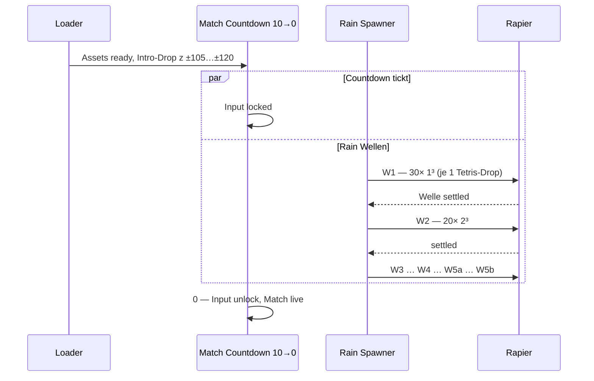
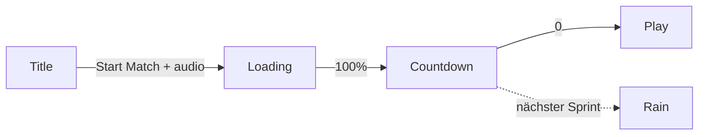

# Environment — Dynamisch & Zerstörbar

Planungsdokument für alles, was **beweglich**, **zerstörbar** oder **respawnend** ist. Statische Arena → [`environment.md`](environment.md).

**Code heute:** Match-Flow **Title → Loading → Countdown → Play** ist live (`match-flow-screen.ts`, `funnel-app.ts`, `dom.ts`, `style.css`). `dynamicBodies: []` (leer). Sync-Hook (`syncRigidBodyObjects`) läuft bereits im Loop. **Noch offen:** Rain-Spawner, oranges Dynamic-Grid-Material, Environment-Damage.

**Intro-Referenz:** [`introduction.md`](introduction.md) §5 — Kinetic Momentum, zerstörbare Umgebung.

---

## Kernidee — „Rain Start“

**Jedes Match sieht anders aus.** Kein festes Slot-Layout — stattdessen ein **Pre-Match-Ritual** während des **10-Sekunden-Countdowns** (UI ✓; Rain **noch nicht** an Countdown gekoppelt):

1. Map ist geladen; **Input gesperrt**. Spieler + Roster spawnen **in der Luft** im **15-m-Match-Start-Band** (`z ±105…±120`, ab **30 m** vom Bulkhead — **vor** den Schutzwürfeln) und **fallen** während des Countdowns. **Tod-Respawn** nur im **Spawn-Pocket** (`z ±135…±150`, letzte **15 m** am Bulkhead). Spec: [`environment.md`](environment.md) § Spawn-Logik.
2. Countdown läuft **10 → 0**; **parallel** startet der Rain in der **neutralen Zone**.
3. Teile fallen **einzeln** von oben (Tetris-artig, nicht alles auf einmal) — **random X/Z**, **random Rotation (alle Achsen)**.
4. **Sechs Wellen** strikt **nacheinander** (1 → 2 → 3 → 4 → 5a → 5b); nächste Welle erst, wenn die aktuelle **settled** ist.
5. Bei **0**: Kampf frei (Rain idealerweise fertig oder letzte Teile landen noch).



**Analogie:** Tetris mit **Zufallsrotation** — jedes Teil muss **sauber in freier Luft** spawnen, darf **nicht in Wände, statische Props oder andere Teile** hinein materialisieren (sonst Rapier-Explosion / „fliegt uns um die Ohren“).

---

## Match-Start — Wellen & Mengen

| Welle | Form | Maße (× × ×) m | Anzahl | Gesamt-Volumen (m³) |
|-------|------|----------------|--------|---------------------|
| **1** | Würfel | **1 × 1 × 1** | **30** | 30 |
| **2** | Würfel | **2 × 2 × 2** | **20** | 160 |
| **3** | Würfel | **3 × 3 × 3** | **10** | 270 |
| **4** | Würfel | **5 × 5 × 5** | **5** | 625 |
| **5a** | Säule | **1 × 1 × 5** | **10** | 50 |
| **5b** | Säule | **2 × 2 × 10** | **10** | 400 |

**Summe:** **85** dynamische Körper pro Match (65 Würfel + 20 Säulen).

**Wellen-Reihenfolge:** immer **1 → 2 → 3 → 4 → 5a → 5b** — **nie parallel** (5a und 5b nacheinander, nicht gleichzeitig).

Säulen sind Boxen in lokalen Maßen — **Random-Quaternion** beim Spawn → liegende Balken, Schräglage, selten aufrecht.

### Drop-Zone — nur neutral, mit Rand-Puffer

Rain **nur** in der **neutralen Zone** (`z ∈ [−50, +50]`, volle Tunnelbreite 50 m). Alpha/Beta-Spawn-Enden bleiben frei von Rain-Spawn.

**10-m-Abstand zum Rand** (Seitenwand + Nord/Süd-Grenze der neutralen Zone) — nichts soll halb in der Wand erscheinen; effektiv „aus der Mitte heraus“:

| Achse | Zone-Grenze | −10 m Puffer | Drop-Bereich (Center X/Z) |
|-------|-------------|--------------|---------------------------|
| **X** | ±25 (Wände) | ±15 | **`x ∈ [−15, +15]`** |
| **Z** | ±50 (Zonengrenze) | ±40 | **`z ∈ [−40, +40]`** |

Footprint **40 × 30 m** in der Mitte des Tunnels — Podest `(0,0)` liegt drin; Eck-Würfel bei `x = ±22.5` **außerhalb** (Rain spawnt dort nicht).

| Aspekt | Vorgabe |
|--------|---------|
| **Y-Spawn** | Oberhalb Decke, z. B. **`y = 52…58`** (Decke `y = 50`); pro Teil leicht variieren |
| **Rotation** | Uniform random **Quaternion** (alle Orientierungen) |
| **Tetris-Takt** | Pro Welle: **ein Teil spawnen → fallen lassen → settled → nächstes Teil** (nicht 30 auf einmal) |
| **Spawn-Validierung** | **Pflicht:** vor Spawn Collider-Overlap-Test (rotierte Box vs. static + bereits gespawnte Bodies). Bei Kollision: neue Random-X/Z/Rotation (max **z. B. 24 Versuche**), sonst Welle überspringen + Log |

**Statische Hindernisse in der Zone** (Podest, 4 Eck-Würfel): Rain-Teile dürfen **darauf landen**, dürfen aber **nicht beim Spawn überlappen** — Validierung muss fixed Collider einbeziehen.

### Masse / Gewicht

**Kein handgesetztes Gewicht pro Prefab.** Rapier leitet Masse aus **Collider-Volumen × `ENVIRONMENT_PHYSICS_DENSITY`** ab (`ColliderDesc.setDensity`).

| Teil | Volumen | Masse ∝ |
|------|---------|---------|
| 1³ | 1 m³ | 1× |
| 2³ | 8 m³ | 8× |
| 3³ | 27 m³ | 27× |
| 5³ | 125 m³ | 125× |
| 1×1×5 | 5 m³ | 5× |
| 2×2×10 | 40 m³ | 40× |

Größere Teile sind schwerer **nur** wegen Volumen — gleiche Dichte für alle Rain-Objekte.

### „Gelandet“ — Wann nächstes Teil / nächste Welle?

| Ebene | Kriterium |
|-------|-----------|
| **Einzelteil** | Body **`isSleeping()`** oder `|v| < ε` für **~15 Frames** |
| **Welle komplett** | Alle Teile dieser Welle settled |
| **Nächste Welle** | Erst nach „Welle komplett“ |
| **Fallback** | Timeout pro Welle **z. B. 15 s** (kein Soft-Lock); Timeout pro Teil **z. B. 8 s** |
| **Countdown-0** | Kampf startet auch wenn Rain noch läuft — Ziel: Rain in **10 s** unter bringen (Tuning) |

## Match-Flow ✅ (UI + Lock)

Anbindung an [`introduction.md`](introduction.md) §10. **Title + Loader + Countdown + Input-Lock** sind implementiert. **Rain** und Countdown-Audio folgen als nächste Schritte.

| Phase | UI | DOM | Was passiert | Status |
|-------|-----|-----|--------------|--------|
| **1 Title** | Vollbild, Brand + „Start Match“ | `#preMatchHost` sichtbar, **`shell` hidden** | Klick → `FunnelAudioContext.resume()` (Audio-Gesture) | ✅ |
| **2 Loading** | Vollbild, Fortschrittsbalken + Label | gleich — **kein Canvas** | Sequenzielles Boot: WebGPU → Rapier → Arena → Shooter-Pack → Combat | ✅ |
| **3 Map + Countdown** | Canvas sichtbar, Overlay 10→0 | `revealMap()` — preMatch weg, **`shell` sichtbar** | Render-Loop läuft; HUD/Status per CSS hidden; `matchLive = false` | ✅ |
| **4 Go** | HUD + Spiel | `dismissCountdown()` — Overlay weg, `data-match-phase="playing"` | `input.connect()`, `matchLive = true`, Movement unlock | ✅ |
| **5 Rain** | — | shell | Tetris-Drops neutral während Phase 3 | ⏳ geplant |



### Implementierung (Referenz)

| Modul | Rolle |
|-------|--------|
| `src/ui/match-flow-screen.ts` | `MatchFlowScreen`: Title/Loader-Panels, `setLoadingProgress`, `runCountdown(10→0)`, Overlay |
| `src/app/dom.ts` | `#preMatchHost` + `#shell` (initial hidden) |
| `src/app/funnel-app.ts` | Orchestrierung: `waitForStartMatch` → load steps → `revealMap` → Animation-Loop → `await runCountdown()` → `matchLive = true` |
| `src/style.css` | `.funnel-prematch-*`, `.funnel-countdown-overlay*`; HUD hidden während `data-match-phase="countdown"` |
| `src/input/input-state.ts` | `IDLE_INPUT_SNAPSHOT` + `connect()` erst nach Countdown |
| `src/player/player-controller.ts` | `setMovementLocked(true)` ab Ready bis Countdown-0 |

**Loader-Stufen heute** (manuell in `funnel-app.ts`, nicht zentraler Asset-Queue): 8 WebGPU → 22 Rapier → 38 Arena → 52 Character → 78 Combat → 92 Finalize → 100 Ready.

**Noch offen (Intro §10):**

- [ ] Rain-Spawner parallel zum Countdown (siehe Kernidee oben)
- [ ] Tick-SFX pro Sekunde + Go-Sound bei 0 ([`audio.md`](audio.md) Phase 6)
- [ ] Zentraler Asset-Loader mit Queue-Events (Intro §10 Loading — aktuell nur Fortschritts-Labels)
- [ ] Bot-Freeze während Countdown (Platzhalter-Bots laufen heute idle weiter)

---

---

## Look — Oranges Raster (nur dynamische Teile)

**Alle** Rain-Objekte (Würfel + Säulen + später Gibs optional vereinfacht) nutzen **dieselbe Grid-Farbe** — unabhängig von alpha/neutral/beta. Damit sind dynamische Brocken sofort lesbar vs. statisches Graublau-Raster.

| Rolle | Hex | Begründung |
|-------|-----|------------|
| **Kanten / Major** | **`0xea7028`** | Warmes Industrial-Orange — gut sichtbar auf `ENVIRONMENT_SURFACE_MATERIAL` (`0x1a2833`), klar getrennt von Team-Rot (`0xd42b2b`), Team-Blau (`0x225dff`) und Neutral-Grau (`0x7b7b7b`) |
| **Innere 1-m-Linien** | **`0x8a4218`** | ~52 % Helligkeit von Major (wie `INNER_GRID_COLOR_SCALE` bei statischen Boxen) |

Fläche: weiterhin **`ENVIRONMENT_SURFACE_MATERIAL`** (Graublau) — **nur Linien orange**, keine orange Albedo-Fläche.

**Vorbereitung:** `grid-tsl.ts` exportiert bereits `buildWorldGridColorNode(gridHex)` / `buildWorldGridEmissiveNode(gridHex)` — statische Zonen nutzen `zoneGridMaterial()` in `environment-grid-material.ts`. Nächster Schritt: `environment-dynamic-style.ts` mit `DYNAMIC_GRID_MAJOR = 0xea7028`, `DYNAMIC_GRID_MINOR = 0x8a4218` und `dynamicGridMaterial()` (Material-Cache analog Zone-Preset).

---

## Entity-Typen

| Typ | Maße | Rapier | Grid | Zerstörbar |
|-----|------|--------|------|------------|
| Rain cube W1–W4 | 1³ … 5³ | `dynamic` | orange | ja (später) |
| Rain pillar | 1×1×5, 2×2×10 | `dynamic` | orange | ja (später) |
| Gib / debris | Bruchstücke | `dynamic` | orange oder vereinfacht | TTL |
| Pickup (Redeemer) | 1³ | sensor / fixed | — | — |
| Statisch | — | `fixed` | zone-neutral/team | **nein** |

---

## Leitplanken (Physik & Tech)

| Thema | Regel |
|-------|--------|
| **Physics** | **Ein** Preset: `ENVIRONMENT_PHYSICS_DENSITY` + friction + restitution |
| **Masse** | **Nur** Volumen × Density — **kein** `setMass`, **kein** Gewicht pro Prefab-Typ |
| **Sync** | `SyncedBody { object, body }` → `arena.dynamicBodies` → `syncRigidBodyObjects` |
| **Spawn-Safety** | Overlap-Test vor jedem Spawn; kein Spawn-in-Spawn (Tetris, kein Glitch-Exploit) |
| **Performance** | 85 Bodies Rain + Gibs gecappt; Geometry/Material-Cache pro Größenklasse |
| **Statisch** | Spawn-Schutzwürfel, Podest, Eck-Würfel, Shell: **fixed, indestructible** |

---

## Zerstörung & Schaden *(Phase 2 — nach Rain v1)*

Rain v1 liefert nur **fallende Physik-Props**. Zerstörung kommt danach:

| Quelle | Ziel |
|--------|------|
| `ImpactProfile.directDamage` | HP auf dynamischen Collidern |
| `impulse` | `applyImpulseAtPoint` — Würfel kippen / fliegen |
| Splash | AoE auf mehrere Rain-Teile |

HP grob skaliert mit Volumen (5³ am schwersten zu zerstören in Welle 4). **Kein Respawn** der Rain-Teile innerhalb desselben Matches — Layout entsteht einmal pro Runde.

**Offen:**

- [ ] Schutzwürfel / Podest: **immer** indestructible
- [ ] Gibs bei Zerstörung: split in kleinere orange Boxen?

---

## Pickups ✅

Health + shield belts share the **Rain air-drop model**: Rapier **dynamic** bodies spawn in the band above the ceiling, fall, tumble, and are collected by proximity. Count stays fixed — each pickup immediately respawns a new air drop.

**Code:** `src/arena/pickup-field.ts` · tuning: `PICKUP_FIELD_CONFIG` in `game-config.ts` · SFX: `audio-one-shots/audio-pickup.ts`.

| Typ | Form | Maße | Farbe | Grant |
|-----|------|------|-------|-------|
| **Shield** | Low-poly sphere (instanced) | r = 0.42 m | `#58d6ff` (HUD + pickup) | +50 shield |
| **Health** | Box | **1 × 0.5 × 1** m | `#58ffb0` (HUD health) | +25 HP |

| Aspekt | Vorgabe |
|--------|---------|
| **Start** | `PickupField.begin()` when countdown rain completes, or at match live if rain disabled |
| **Spawn** | Random **X/Z** in rain footprint, **Y ∈ [10…14]** + half-extent (countdown-visible band, same as rain), random **quaternion** |
| **Physik** | Dynamic rigid body — **no actor collision** (Rapier groups); tumbles on environment + rain debris only |
| **Combat** | Hitscan + projectile rays **ignore** pickup colliders |
| **Collect** | Sphere radius **1.35 m** vs actor capsule; skip if HP/shield already full |
| **Respawn** | On collect: body removed → **instant** new air drop (same slot) — pool size unchanged |
| **Audio** | Spatial chime at pickup position (`playPickupAt`) |

Redeemer-Anker: `REDEEMER_SPAWN_POSITION` `(0, 2.5, 0)` — unabhängig vom Rain; `fixed` auf Podest (P7).

```mermaid
sequenceDiagram
  participant Match as Match live
  participant Field as PickupField
  participant Phys as Rapier
  participant Actor as Player/Bot

  Match->>Field: begin() — 6 shield + 6 health air drops
  Field->>Phys: dynamic bodies + colliders
  Phys-->>Field: fall, tumble, sleep
  Actor->>Field: walk within 1.35 m
  Field->>Actor: addHealth / addShield
  Field->>Field: playPickupAt + spawnDrop (replacement)
```

---

## Code-Architektur (Ziel)

```
src/arena/
  environment-dynamic-style.ts      # DYNAMIC_GRID_COLOR orange
  environment-physics-material.ts   # DENSITY, friction, restitution
  environment-dynamic-body.ts       # createDynamicEnvironmentBox(size, pos, quat)
  match-phase.ts                    # (optional split) — Rain koppeln
  environment-rain-spawner.ts       # Wellen, Tetris single-drop, overlap test
  pickup-field.ts                   # Health + shield air-drop pickups (dynamic)
  environment-destructible.ts       # Phase 2: HP, destroy
  environment-gib-spawner.ts        # Phase 2
  funnel-arena.ts                   # startRainSequence() → dynamicBodies

src/app/funnel-app.ts               # sync + optional rain state machine tick
src/combat/environment-hit.ts       # Phase 2
```

### Rain-Spawner API (Skizze)

```typescript
interface RainWaveSpec {
  readonly id: string;
  readonly count: number;
  readonly size: [number, number, number]; // meters
}

const RAIN_WAVES: readonly RainWaveSpec[] = [
  { id: 'cube-1', count: 30, size: [1, 1, 1] },
  { id: 'cube-2', count: 20, size: [2, 2, 2] },
  { id: 'cube-3', count: 10, size: [3, 3, 3] },
  { id: 'cube-5', count: 5, size: [5, 5, 5] },
  { id: 'pillar-1x5', count: 10, size: [1, 1, 5] },
  { id: 'pillar-2x10', count: 10, size: [2, 2, 10] }
];
```

---

## Implementierung — Phasen

| Phase | Inhalt | Status |
|-------|--------|--------|
| **P3** | Match-Flow UI: Title → Load → Countdown, Input/Movement-Lock | ✅ **done** |
| **P0** | Physics-Preset + `createDynamicEnvironmentBox` + oranges Grid-Material | ⏳ **nächster Sprint** |
| **P1** | Rain W1 Tetris (30× 1³), Drop-Bounds neutral, Overlap-Test | nach P0 |
| **P2** | Alle 6 Wellen sequenziell; `dynamicBodies` sync im Loop | nach P1 |
| **P4** | Rain-Spawner **während** Countdown (10 s Budget) | nach P2 |
| **P4b** | Countdown-Tick-Audio + Go-Sound | parallel zu P4 möglich |
| **P5** | Environment-Damage + Impulse | Phase 2 |
| **P6** | Zerstörung + Gibs | Phase 2 |
| **P7** | Redeemer-Pickup | später |

Nach **P4** ist die Kernvision spielbar: **jedes Match anderer Trümmerhaufen** während der Countdown-Phase.

---

## Nächste Schritte (empfohlene Reihenfolge)

### Sprint A — Dynamic Body Foundation (P0)

1. **`environment-physics-material.ts`** — `ENVIRONMENT_PHYSICS_DENSITY`, friction, restitution als ein Preset; nur `ColliderDesc.setDensity`, kein `setMass`.
2. **`environment-dynamic-style.ts`** — Orange Grid-Hex + `dynamicGridMaterial()` über bestehende `grid-tsl`-Nodes.
3. **`environment-dynamic-body.ts`** — `createDynamicEnvironmentBox(scene, world, size, position, quaternion)` → `{ object, body }` als `SyncedBody`; Body in `arena.dynamicBodies` pushen.
4. **Smoke-Test** — Ein 1³-Box manuell über der neutralen Zone droppen (Dev-Taste oder temporärer Spawn in `funnel-app`); visuell oranges Raster, Physik settled, Sync ok.

### Sprint B — Rain v1 (P1 → P2)

5. **`environment-rain-spawner.ts`** — State-Machine: Welle → ein Teil → settled → nächstes; Drop-Bounds `x ∈ [−15,+15]`, `z ∈ [−40,+40]`, `y ≈ 52…58`.
6. **Overlap-Validierung** — Rapier Shape-Test gegen fixed Collider + bereits gespawnte Bodies; max ~24 Retries.
7. **Welle 1 allein** committen & tunen (Tetris-Takt, Sleep/ε-Kriterium, Welle-Timeout 15 s).
8. **Wellen 2–5b** sequenziell aktivieren; `RAIN_WAVES`-Tabelle aus diesem Doc.

### Sprint C — Countdown-Kopplung (P4)

9. **`funnel-arena.ts`** — `startRainSequence(world, scene)` oder Spawner-Instanz auf `FunnelArena` returnen.
10. **`funnel-app.ts`** — Spawner-Tick **parallel** zu `runCountdown()` (Rain startet bei `revealMap()` oder Countdown-Start, nicht erst bei 0).
11. **Tuning** — 85 Teile in ≤10 s oder dokumentiertes Fallback (Rest nach Go).
12. **Intro-Drop** — Luft-Spawn im Band **30…45 m** vom Bulkhead (`z ±105…±120`); Fall während Countdown; Input/Locomotion gesperrt bis `0`.
13. **Bots** — während Countdown kein Locomotion-/Combat-Tick (Fall-only oder eingefroren bis Boden).

### Danach

- Countdown-Audio (P4b), Environment-Hit (P5), Gibs (P6), Redeemer-Pickup (P7).

---

## Offene Fragen

### Timing / Match

- [ ] Rain muss in **10 s** fertig sein — sonst Drop-Intervalle kürzen oder kleinere Wellen in Countdown, Rest nach `0`?
- [ ] Intro-Drop Y-Band — gleiche sichtbare Höhe wie Countdown-Rain (`RAIN_COUNTDOWN_SPAWN_Y` ~10–14 m) oder höher unter Überdachungskante?
- [ ] Bots nach Intro-Drop: im Pocket verteilen oder an Gap-Position stehen bleiben?

### Tech

- [ ] Overlap-Test: Rapier `intersectionsWithShape` vs. eigener AABB-OBB-Test
- [ ] Instancing pro Größenklasse (6 Geometrien)
- [ ] Seed pro Match (reproduzierbar für Debug)
- [ ] Konkreter `ENVIRONMENT_PHYSICS_DENSITY`-Wert (kg/m³)

---

## Spawn-Matrix

| Kategorie | Trigger | Maße | Anzahl | Physik | Grid | Status |
|-----------|---------|------|--------|--------|------|--------|
| Rain cube | Pre-Match Countdown | 1³ … 5³ | 65 | dynamic | **orange** | **geplant** |
| Rain pillar | Pre-Match Countdown W5a→5b | 1×1×5, 2×2×10 | 20 | dynamic | **orange** | **geplant** |
| Gib debris | Zerstörung | < Parent | TBD | dynamic | orange? | später |
| Redeemer | Podest | 1³ | 1 | fixed/sensor | — | später |
| Spawn-Schutzwürfel | Level load | 5³ | 20 | fixed | team | statisch ✓ |

---

## Changelog

| Datum | Notiz |
|-------|-------|
| 2026-05-23 | Doc angelegt; Slot-Modell, Architektur-Skizze |
| 2026-05-23 | **Kernidee Rain Start:** sequenzielle Wellen, oranges Raster `0xea7028` |
| 2026-05-23 | Match-Flow UI: Title → Loader → Countdown 10→0 (`match-flow-screen.ts`) |
| 2026-05-23 | Doc: Match-Flow als ✅ markiert; Sprint A/B/C für Rain + Dynamic Bodies geplant |
