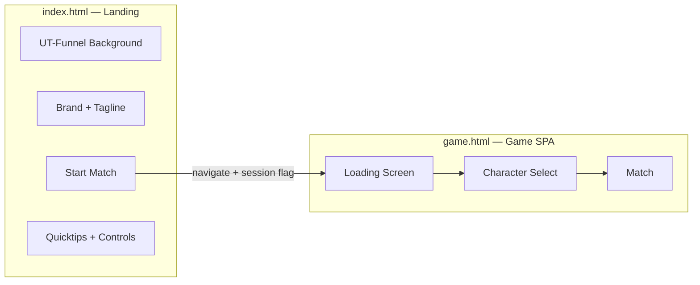

# FUNNEL — Home Screen & Loading Screen (Plan)

Design- und Architekturplan für einen **eigenständigen Home Screen** als HTML-Seite (Web-Landing-Feeling) und einen **komplett getrennten Loading Screen**. Der zentrale CTA bleibt **Start Match**.

**Referenzen:** `docs/user-journey.md` (Match-Flow Phasen), `docs/interface-ui.md`, `docs/introduction.md` §1, Ist-Code `src/ui/match-flow-screen.ts`, `index.html`.

**Inspiration:** UT99-Community-Mod **Funnel** (~2000–2002) — langer industrieller Tunnel, Team-Zonen an den Enden, Jump-Pads, Metall/Grid-Böden, rote und blaue Lichtakzente. Nicht 1:1-Remake, sondern **Stimmung** für den statischen Home-Hintergrund.

---

## 1. Zielbild

| Heute | Neu |
|-------|-----|
| Alles in einer SPA: Home + Loader per JS in `#preMatchHost` | **Zwei HTML-Einstiege:** Landing + Game |
| Schmale Karte (~440 px) mittig | **Breites Web-Layout** — Hero, Spalten, Vollbild-Hintergrund |
| Home und Loader teilen `.funnel-prematch-*` | **Getrennte Markup-, CSS- und JS-Wurzeln** |
| Start Match startet sofort WebGPU-Boot im gleichen Dokument | Start Match **navigiert** zur Game-Seite → dort nur Loader/Boot |

### Erfolgskriterien

1. **Home** lädt ohne Three.js, Rapier oder Shooter-Pack — First Paint < 100 ms (nur HTML/CSS + minimales JS).
2. **Start Match** ist visuell und hierarchisch der dominante Button auf der Seite.
3. **Hintergrund** erinnert an UT-Funnel: Tunnel, Industrie, Team-Farben — rein CSS/HTML (optional dezentes Canvas/CSS-3D, kein WebGPU).
4. **Loading Screen** hat eigenes Layout, keine Quicktips/Steuerung/Marketing — nur Fortschritt + Label (+ optional kleines Logo).
5. Bestehender Spiel-Flow danach unverändert: Character Select → Game Load → Countdown → Playing (`docs/user-journey.md`).

---

## 2. Seiten-Architektur (Multi-Page)

Vite unterstützt mehrere HTML-Einstiegspunkte. Vorschlag:

| Datei | Rolle | Bundle |
|-------|--------|--------|
| **`index.html`** | Home / Landing | `src/home/main.ts` (minimal) |
| **`game.html`** | Arena-App | `src/main.ts` → `funnel-app.ts` (bestehend) |



### 2.1 Navigation Start Match

1. Klick auf **Start Match** (User-Gesture auf Home).
2. `sessionStorage.setItem('funnel:boot', '1')` — Intent für Auto-Start auf Game-Seite.
3. Optional: `sessionStorage.setItem('funnel:audioPending', '1')` — Hinweis für Game-Boot.
4. `location.href = './game.html'` (relativ wegen `base: './'` in Vite).

**Audio-Hinweis:** `AudioContext.resume()` gilt pro Dokument. Der Klick auf Home **entsperrt kein Audio** auf `game.html`. Lösung im Game-Boot:

- Beim ersten Frame mit `funnel:boot`: Loading sofort anzeigen, `resumeGameAudio()` beim **ersten Klick/Touch auf dem Loader** oder synchron beim Laden, falls Browser die Navigation-Gesture durchreicht (nicht verlässlich → Fallback-Klick auf Loader-Panel akzeptabel, oder unsichtbarer „Tap to continue“ nur wenn resume fehlschlägt).

**Pointer Lock / Fullscreen:** Erst auf Game-Seite, **nach** Character Select oder beim Übergang zur Arena — nicht mehr beim Home-Klick (Home ist „normale Webseite“).

### 2.2 Vite-Anpassung

```ts
// vite.config.ts — build.rollupOptions.input
{
  index: 'index.html',
  game: 'game.html',
}
```

Dev: `http://localhost:3011/` = Home, `http://localhost:3011/game.html` = Spiel.

---

## 3. Home Screen — Layout (Web-Landing)

Ziel: Auf großem Monitor wirkt die Seite wie eine **Produkt-Landingpage**, nicht wie ein modales Spiel-Menü.

### 3.1 Grob-Layout (Desktop ≥ 1200 px)

```
┌──────────────────────────────────────────────────────────────────────────┐
│  [Background: Tunnel-Perspektive + Grid + Team-Glow links/rechts]        │
│                                                                          │
│  ┌─────────────────────────────┐  ┌──────────────────────────────────┐  │
│  │  HERO (links, ~55 %)        │  │  INFO (rechts, ~45 %)             │  │
│  │  Arena shooter              │  │  ┌ Quicktip ─┐ ┌ Quicktip ─┐      │  │
│  │  FUNNEL                     │  │  └──────────┘ └──────────┘      │  │
│  │  HAVE FUN IN THE TUNNEL     │  │  ┌ Quicktip ─┐ ┌ Quicktip ─┐      │  │
│  │                             │  │  └──────────┘ └──────────┘      │  │
│  │  ┌─────────────────────┐   │  │  Controls (dl, kompakt)           │  │
│  │  │    START MATCH      │   │  │  Health warning (klein)           │  │
│  │  └─────────────────────┘   │  │                                   │  │
│  └─────────────────────────────┘  └──────────────────────────────────┘  │
│                                                                          │
│              Optimized for macOS + M1 and latest Chrome                  │
└──────────────────────────────────────────────────────────────────────────┘
```

### 3.2 Mobile / schmal (< 900 px)

- Einspaltig: Hero oben (Brand + **Start Match**), Info darunter.
- Button bleibt above-the-fold wenn möglich.

### 3.3 Inhalt (aus Ist-Home übernehmen)

| Block | Quelle | Anmerkung |
|-------|--------|-----------|
| Kicker | `Arena shooter` | |
| Brand | `FUNNEL` | Größer als heute — Hero-Typo |
| Tagline | `HAVE FUN IN THE TUNNEL` | |
| Quicktips | `HOME_QUICKTIPS` in `match-flow-screen.ts` | 2 Karten, evtl. 2×2 Grid |
| Controls | `<dl>` wie heute | Rechte Spalte oder Accordion mobile |
| Health warning | Epilepsie-Hinweis | Dezent, unter Info |
| Footer | `renderPlatformTargetNoteHtml()` | Nur Home |
| **CTA** | **Start Match** | `.funnel-home__start` — min. 48 px Höhe, volle Hero-Breite max ~360 px |

**Entfernt vom Home (bleiben nur auf Game-Seite):** Character Select, Loader, Countdown.

### 3.4 Semantisches HTML (`index.html`)

Statisches Markup — **kein** `innerHTML` aus TS für die Landing-Struktur.

```html
<!doctype html>
<html lang="en" translate="no">
  <head>…</head>
  <body class="funnel-home">
    <div class="funnel-home__background" aria-hidden="true">
      <!-- rein dekorativ: Tunnel-Layer -->
    </div>
    <main class="funnel-home__main">
      <section class="funnel-home__hero">…</section>
      <aside class="funnel-home__info">…</aside>
    </main>
    <footer class="funnel-home__footer">…</footer>
    <script type="module" src="/src/home/main.ts"></script>
  </body>
</html>
```

`src/home/main.ts`: nur Start-Button-Handler + optional Platform-CSS-Klasse (`funnel-platform-target`).

---

## 4. Background — Anlehnung UT99 Funnel (~2001)

### 4.1 Visuelle Leitplanken (Mod-/Map-Family)

Aus der Funnel-Community (CTF-Funnel, Funnel-Chaos, Funnel Mega, `Funnel.utx` / `Funnel_Mad.utx`):

| Motiv | Umsetzung Home (CSS) |
|-------|----------------------|
| **Langer Tunnel** | Zentralperspektive: zwei konvergierende „Wände“ + dunkler Korridor in der Mitte (`linear-gradient` + `clip-path` oder pseudo-3D-Trapes) |
| **Industrieller Boden** | Bestehendes Ally-Grid (`--funnel-grid-*`) — bereits in `style.css`, auf `.funnel-home__background` |
| **Metall-Wände** | Diagonale Streifen / leichte Rausch-Textur (CSS `repeating-linear-gradient`, optional subtiles SVG-Noise als Data-URI) |
| **Team-Endzonen** | Links schwacher **Rot-Glow** (Enemy), rechts **Blau-Glow** (Ally) — `radial-gradient` an den Seiten, 15–25 % Opacity |
| **Decken-/Boden-Linien** | Horizontale „Ribbons“ die zur Mitte konvergieren (Tunnel-Tiefe) |
| **Jump-Pad-Feeling** | Optional: ein oder zwei statische leuchtende Rechtecke im Boden (CSS only, keine Animation nötig für v1) |

Farben an bestehende Tokens binden:

- Boden: `#141b24` (`--funnel-grid-base`)
- Ally-Akzent: `#225dff`
- Enemy-Akzent: `#d42b2b`
- Nebel/Distanz: `#050607` → `#141b24`

### 4.2 Layer-Stack (v1 — nur CSS)

```
.funnel-home__background
  ├── .funnel-home__bg-grid      (bestehendes 1m/5m Grid, perspective optional)
  ├── .funnel-home__bg-tunnel    (Konvergenz-Linien, Vignette)
  ├── .funnel-home__bg-walls     (Metall-Streifen links/rechts)
  └── .funnel-home__bg-glow      (Team-Rim-Lights)
```

**Kein WebGPU** auf Home. Optional **Phase 2:** leichtes `<canvas>` mit 2D-Partikeln (Staub/Funken) — nur wenn CSS allein zu flach wirkt; Budget: < 1 ms/frame, pausiert wenn Tab hidden.

### 4.3 Abgrenzung zur Arena

| Home Background | Arena |
|-----------------|--------|
| Statisch, suggestiv | Echte 50×300×50 m Geometrie |
| 2D-Perspektive-Illusion | WebGPU + Rapier |
| Marketing-Stimmung | Gameplay |

---

## 5. Loading Screen — komplett getrennt

### 5.1 Eigene Wurzel

| Aspekt | Home | Loading |
|--------|------|---------|
| HTML | `index.html` | **`game.html`** — eigener Block `#funnel-loader` |
| CSS | `src/home/home.css` | **`src/ui/loading-screen.css`** (neu) |
| TS | `src/home/main.ts` | **`src/ui/loading-screen.ts`** (neu) |
| Klassen-Präfix | `.funnel-home__*` | `.funnel-loader__*` — **kein** `.funnel-prematch-*` |

Loader lebt **nur** in `game.html`, bis `revealMap()` das Shell-Canvas zeigt.

### 5.2 Loader-Layout

Minimal, utilitarisch — **kein** Marketing, keine Steuerungstabelle.

```
┌────────────────────────────────────────┐
│         [ dunkler Vollbild-Scrim ]     │
│                                        │
│              FUNNEL                    │  ← klein, optional
│         Preparing arena…               │  ← Label (dynamisch)
│         ████████░░░░░░░░  42%          │  ← Track + Fill
│                                        │
└────────────────────────────────────────┘
```

- Hintergrund: einfarbig `#050607` oder sehr subtiles Grid (schwächer als Home — Loader soll „System“ wirken, nicht „Website“).
- Fortschritt: bestehende `setLoadingProgress(percent, label)`-Semantik beibehalten.
- Z-index über `#app` / Canvas bis Character Select oder Map-Reveal.

### 5.3 Phasen im Loader

Entspricht `docs/user-journey.md`:

| Phase | UI | Modul |
|-------|-----|--------|
| Boot loading | `#funnel-loader` sichtbar | `LoadingScreen` + `funnel-app` frühe Steps |
| Character select | Loader aus, Canvas + Overlay | `character-select-scene.ts` |
| Game loading | `#funnel-loader` wieder | nach Rig-Wahl |
| Map + countdown | Loader aus, `#shell` sichtbar | `MatchFlowScreen` (nur Countdown behalten) |

---

## 6. Refactor `MatchFlowScreen`

Heute bündelt `match-flow-screen.ts` Home + Loader + Countdown. Nach dem Split:

| Verantwortung | Zielmodul |
|---------------|-----------|
| ~~Home Panel~~ | entfällt — HTML in `index.html` |
| Boot/Game Loader | **`LoadingScreen`** (`loading-screen.ts`) |
| Character-Select-Overlay | bleibt in MatchFlow oder `character-select-ui.ts` |
| Countdown 10→0 | bleibt `MatchFlowScreen` (oder `countdown-overlay.ts`) |

`waitForStartMatch()` entfällt — ersetzt durch:

```ts
// game.html boot
if (sessionStorage.getItem('funnel:boot') === '1') {
  sessionStorage.removeItem('funnel:boot');
  startFunnelApp(appRoot); // kein await auf Home-Button
} else {
  // Fallback: redirect zu index.html
  location.replace('./index.html');
}
```

---

## 7. CSS-Organisation

| Datei | Scope |
|-------|--------|
| `src/home/home.css` | Nur `.funnel-home__*` + Import shared tokens |
| `src/ui/loading-screen.css` | Nur `.funnel-loader__*` |
| `src/style.css` | Game HUD, Shell, Countdown — **Home/Loader-Regeln entfernen** nach Migration |

Shared Design Tokens bleiben in `:root` (Farben, Buttons). `.funnel-btn` kann in `src/shared/button.css` oder am Anfang von `style.css` + von `home.css` importiert werden.

**Home-spezifisch:** `body.funnel-home { overflow: auto; }` — Landing darf scrollen; Game behält `overflow: hidden`.

---

## 8. Implementierungsphasen

| Phase | Inhalt | Aufwand |
|-------|--------|---------|
| **A — Docs** | Dieses Dokument, Verweis in `user-journey.md` §0 | ✅ |
| **B — HTML-Split** | `game.html`, `index.html` Landing-Markup, Vite multi-input | ✅ |
| **C — Home CSS** | Tunnel-Background v1, Hero-Layout, Start Match | M |
| **D — LoadingScreen** | Neues Modul + CSS, aus `MatchFlowScreen` extrahieren | M |
| **E — Boot-Wiring** | `funnel-app.ts`, sessionStorage, Redirect-Fallback | S |
| **F — Cleanup** | `.funnel-prematch-*` Home/Loader aus `style.css` + `match-flow-screen.ts` | S |
| **G — Polish** | Responsive Feinschliff, optional 2D-Partikel | optional |

---

## 9. Offene Entscheidungen

1. **URL-Struktur:** `./game.html` vs. `/play` (Rewrite braucht Server-Config — für statisches Hosting `game.html` bevorzugen).
2. **Direktlink auf Game:** Redirect zu Home vs. Mini-„Start Match“ auf leerer Game-Seite.
3. **Fullscreen:** Beim Loader, bei Character Select oder erst bei Countdown? (Empfehlung: **Countdown**, Home bleibt Browser-Tab normal.)
4. **Background v2:** Screenshot/Art aus UT-Funnel als subtiles `` unter CC/ eigener Art — nur wenn Team rechtlich OK; sonst rein prozedural CSS.
5. **i18n:** Home erst EN, DE später?

---

## 10. Abnahme-Checkliste

- [ ] `index.html` lädt ohne WebGPU/Rapier in Network-Tab
- [ ] Start Match navigiert zu `game.html` und startet Loader
- [ ] Loader zeigt Fortschritt während bisherigem Boot
- [ ] Character Select → Game Load → Countdown unverändert spielbar
- [ ] Home auf 1920×1080: Hero + Side-by-side, CTA klar dominant
- [ ] Home auf Mobile: einspaltig, Button erreichbar
- [ ] `npm run build` erzeugt `dist/index.html` + `dist/game.html`
- [ ] `npm run lint` grün

---

*Stand: 2026-05-25 — Planung Home als eigene HTML-Seite + getrennter Loader; Umsetzung folgt in Phase B–F.*
