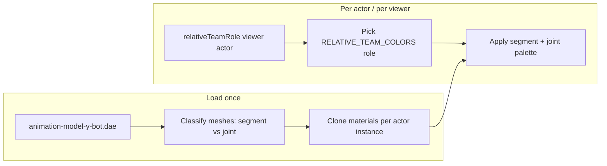

# Team Design — Fraktion, Viewer-Farben & Y-Bot-Suit

Design-Notiz für die **visuelle Team-Erkennung** am Mixamo **Y-Bot** (Shooter-Pack). Beschreibt Produktregeln und den **Ist-Stand** der Team-Implementierung; Abschnitte 4–7 sind die geplante Feintuning-Pipeline (Segment vs. Joint, Material-Klone).

**Code-Stand:** Team-Grundlage + **volles Dev-Roster** (`bot-placeholder-roster.ts` / `bot-roster.ts`). Siehe auch `docs/umsetzung.md` Phase 7.

**Pro-Teamgröße (Pflicht):** **15 Mitglieder pro Teamseite** — erst wenn **15v15** (1 Spieler + 14 Alliierte vs. 15 Gegner) unter Stress flüssig läuft, gilt das Game als performant genug. Quelle: `playersPerTeam: 15` in `src/platform/chrome-macos-arm-profile.ts` (alle Profile).

**Spec-Quelle:** `docs/introduction.md` §8 (Absolute Color Rule).  
**Asset:** `public/Shooter-Pack/animation-model-y-bot.dae` — segmentiertes Mannequin-Mesh + dunkle **Gelenkgeometrie** (Joint-Spheres) am Rig.

---

## 1. Zwei Ebenen — nicht verwechseln

| Ebene | Was der Spieler „ist“ | Sichtbar als | Farbe |
|-------|------------------------|--------------|--------|
| **Fraktion** | `alpha` oder `beta` | HUD-Label („Team Alpha“), Spawn-Seite, Scoreboard später | **Neutral** — Badge-Styling, nicht Suit-Farbe |
| **Viewer-relatives Rolle** | Verbündeter oder Gegner *aus Sicht des lokalen Spielers* | Y-Bot-Suit, später Bots, Hire-Flip | **Immer** Ally = Blau, Enemy = Rot |

**Wichtig:** Team Alpha ist **nicht** „immer blau“ und Beta **nicht** „immer rot“. Ein Beta-Spieler, den *du* als Gegner siehst, ist **rot**; derselbe Charakter wirkt für seinen Teammate **blau**. Das ist bewusst (schnelle Zielerkennung in der Funnel-Chaos-Phase).

Die Idee „Alpha = blaues Suit, Beta = rotes Suit“ würde Intro §8 brechen — nur für interne Debug-Skins oder Editor-Vorschau denkbar, nicht für Matchplay.

---

## 2. Y-Bot — was wir einfärben

Der Y-Bot ist kein „echter“ Character-Skin, sondern ein **Proxy-Mannequin**:

- **Segmente** — hellblaue/cyan Körperteile (pro Knochenbereich ein Mesh, skinned).
- **Joint-Spheres** — dunkle Kugeln/Kapseln an Ellenbogen, Knie, Hüfte usw. (eigenes Mesh, nicht der Bone selbst).

Ziel-Look (pro viewer-relatives Rolle):

| Mesh-Typ | `color` (Albedo) | `emissive` | `emissiveIntensity` |
|----------|------------------|------------|---------------------|
| **Segmente** | Kräftiges Team-Blau / Team-Rot | Sehr dunkel oder gleiche Farbe, niedrig | **Niedrig** (0–0.25) — Suit wirkt „lackiert“, nicht neon |
| **Joint-Spheres** | Team-`base` | `emissiveGlow` (leicht heller, gleicher Hue) | **Moderat** (~0.4) — in Teamfarbe leuchten, nicht weiß |

Technik: `MeshStandardMaterial` über WebGPU (`three/webgpu`) — gleiches Muster wie Waffen-Placeholder in `player-visual.ts` (`emissive` + `emissiveIntensity`). Kein separates Bloom nötig für MVP; später optional Post/TSL.

---

## 3. Ist-Zustand (Team-Grundlage + Styling-Bots)

### 3.1 Fraktion, HUD, lokaler Spieler

| Modul | Aufgabe |
|-------|---------|
| `src/combat/team-color-derive.ts` | **`TEAM_BASE_HEX`** (je 1× ally/enemy) + `deriveTeamHex()` (HSL: dunkler/heller/leuchtend) |
| `src/combat/teams.ts` | `FactionTeam`, `RELATIVE_TEAM_COLORS`, `relativeTeamRole()` |
| `src/combat/match-roster.ts` | Match-Limits aus `playersPerTeam` (Pro: **14 allied + 15 enemy** bots), Spawn-Slots |
| `src/platform/chrome-macos-arm-profile.ts` | `playersPerTeam: 15` — alle Runtime-Profile |
| `src/player/player-team.ts` | Lokale Fraktion, `flip('hire' \| 'dev')`, `TeamChangeEvent` |
| `src/player/team-visual-colors.ts` | `applyRelativeTeamColors(root, role)` — ein Palette-Paar auf alle `MeshStandardMaterial`-Meshes |
| `src/player/player-visual.ts` | `mountShooterPack()`, `applyLocalAllyColors()` → immer `ally` |
| `src/ui/team-hud.ts` | Badge-Text = Fraktionsname; CSS `data-team="alpha\|beta"` |
| `src/app/funnel-app.ts` | Ein Shooter-Pack-Load für Spieler + Bots; Dev-`T` → Fraktions-Flip + Bot-Re-Tint |

### 3.2 Bot-Platzhalter (Styling / Gegner sichtbar)

| Modul | Aufgabe |
|-------|---------|
| `src/combat/bot-placeholder.ts` | Einzelner Actor: Klon, Idle (`rifle-aiming-idle`), viewer-relative Tint |
| `src/combat/bot-placeholder-roster.ts` | Spawnt Dev-Roster, `update(mixer)`, `refreshViewerColors()` bei `PlayerTeam.onChange` |
| `src/player/shooter-pack-clone.ts` | `SkeletonUtils.clone` für skinned Y-Bot |
| `src/player/animation-clip-registry.ts` | `fork(mixer)` — eigener Mixer/Actions pro Bot |

**Dev-Roster (Pro):** **14 Verbündete** (blau) + **15 Gegner** (rot) — skaliert automatisch über `devPlaceholderBotCounts()` / `matchRosterLimits()` aus `playersPerTeam`. Stress-Baseline und Abnahme: volles **15v15**, nicht reduzierte Zähler.

**Boden-Anker:** Actor-Root steht auf `PLAYER_GROUNDED_CENTER_Y` (`halfHeight + radius` ≈ 0,875 m), nicht auf `y = 0`. Das Mesh hängt wie beim Spieler um `-(halfHeight + radius)` — Root auf Bodenhöhe würde den Charakter halb versenken (`game-config.ts`, `bot-placeholder.ts`).

### 3.3 Noch offen (Design-Pipeline)

- Joint-Spheres vs. Segmente: dieselbe Emissive-Stärke (kein „leuchtende Gelenke“-Layer).
- Materialien pro Bot noch nicht geklont — geteilte Collada-Material-Referenzen möglich, bis `classifyYBotMeshes` + `cloneMaterialsForTeamTint` (§4).
- Lokaler Suit bleibt nach `T` **ally-blau** (korrekt §8); Platzhalter-Bots **wechseln** rot/blau über `refreshViewerColors()` (Gegner werden Verbündete und umgekehrt).

---

## 4. Geplante Pipeline



### 4.1 Laden (einmalig pro Character-Instanz)

1. `loadShooterPackCharacter()` wie heute.
2. **`classifyYBotMeshes(model)`** — beim ersten `traverse` jedes `Mesh` taggen:
   - `kind: 'segment' | 'joint'`
   - Heuristik-Reihenfolge (DEV einmal loggen, dann fest codieren):
     - Material-/Mesh-**Name** aus Collada (z. B. `joint`, `sphere`, `pivot` …)
     - Ausgangs-**Farbe** der importierten Materialien (dunkelgrau/schwarz → joint, cyan/blau → segment)
     - Optional: **Bounding-Volume** — kleine Kugeln nahe Bone-Pivots
   - Ergebnis in `Map<Mesh, YBotMeshKind>` oder `userData.meshKind` am Mesh.
3. **`cloneMaterialsForTeamTint(model)`** — jedes Mesh bekommt **eigene** `MeshStandardMaterial`-Kopie (sonst teilen sich alle Bots eine Referenz aus dem Loader).
4. Nicht-`MeshStandardMaterial` aus Collada → einmalig auf `MeshStandardMaterial` migrieren (Roughness/Metalness feste Mannequin-Werte).

### 4.2 Einfärben (beliebig oft)

Neue API (Konzept):

```ts
applyRelativeTeamColors(root, role, { segment, joint }?)
```

- Default-Paletten aus `RELATIVE_TEAM_COLORS`, erweitert um **zwei** Einträge pro Rolle:

```ts
ally: {
  segment: { color, emissive, emissiveIntensity },
  joint:   { color, emissive, emissiveIntensity }  // joint.emissiveIntensity >> segment
}
```

- Pro Mesh: `meshKind === 'joint'` → Joint-Palette, sonst Segment-Palette.
- `material.needsUpdate = true` nur bei echten Änderungen.

### 4.3 Wann aufrufen

| Ereignis | Wer | Rolle | Aktion |
|----------|-----|-------|--------|
| Spawn / Load | Lokaler Spieler | `ally` (eigene Fraktion = immer „deine Seite“ für Suit) | `applyRelativeTeamColors(localRoot, 'ally')` |
| Spawn | Bot / Remote | `relativeTeamRole(localFaction, actorFaction)` | Pro Instanz einmal + bei Hire |
| `PlayerTeam.flip('hire')` | **Andere** Akteure, die Fraktion wechseln | Rolle neu berechnen | Re-apply für **deren** Mesh (lokal: du bleibst ally-blau) |
| Dev `T` | Lokale **Fraktion** in HUD | Suit lokal unverändert ally | HUD `TeamHud.update` + `BotPlaceholderRoster.refreshViewerColors()` |

**Hire (MVP ✅):** `actor-hired` → `combatActor.setFaction` + `BotVisual.setFaction` / `applyViewerColors` — Material-Tint (Blau ↔ Rot). Lokaler Spieler als Hirer: Ziel-Bot wechselt Viewer-Rolle; `TeamRosterCounter.onHired` aktualisiert Mitgliederzahl. Bot-KI-Hire (Phase K) noch offen — siehe `docs/revive-hire.md`.

---

## 5. Farbe — ein Hex, Rest per Code

**Quelle:** `TEAM_BASE_HEX` in `src/combat/team-color-derive.ts`

| Rolle | Einziger Wert |
|-------|----------------|
| **ally** | `0x225dff` |
| **enemy** | `0xd42b2b` |

Dunkler / heller / leuchtend: `deriveTeamHex(role, kind)` — HSL-Multiplikatoren nur in `DERIVE` (`emissiveDim`, `emissiveGlow`, `muted`, `trim`). **Keine** weiteren Hex-Listen pflegen.

**Umsetzung:** Segmente `base` + `emissiveDim` + Intensity ~0.18; Gelenke `base` + `emissiveGlow` + Intensity ~0.42 (Feintuning in `team-visual-colors.ts`).

HUD/CSS bleibt **fraktionsbezogen** (Alpha/Beta Border-Nuance), unabhängig vom Suit.

---

## 6. Multiplayer & Performance

- **Pro Actor eine geklonte Material-Set** — Pflicht sobald >1 Y-Bot in der Szene.
- **Pro Viewer keine zweite Mesh-Kopie** — dieselbe Instanz, aber in lokalem Client immer `relativeTeamRole(local, actor)`; bei echtem Multiplayer kommt Netzwerk-Sync der **Fraktion**, nicht der Farbe (Farbe leitet sich clientseitig ab).
- **Hot path:** Kein `traverse` pro Frame — nur bei Spawn, Hire, Fraktionswechsel.
- **Später (Intro-Checkbox):** Uniform/Instance-Attribute für Emissive → ein Draw Call für N Bots; Material-Tint reicht bis Bot-Spawn steht.

---

## 7. Was bewusst nicht in Phase 1

- Fraktionsfarbe am Suit (Alpha=blau, Beta=rot).
- Bloom / TSL-Glow nur für Gelenke (siehe `docs/visual-effects.md` wenn Post-Stack da ist).
- Eigene PBR-Shader — erst wenn Instancing + Hire-Flip Profiling verlangen.
- Ersetzen des Y-Bot durch finalen Character — Skeleton (`mixamorig_*`) bleibt; Klassifikation Segment/Joint muss am neuen Mesh **neu** kalibriert werden (gleiches Konzept).

---

## 8. Implementierungs-Reihenfolge (für die nächste Coding-Session)

1. **Inspect** — einmalig DEV-Log aller Mesh- und Materialnamen/-farben aus `animation-model-y-bot.dae`; `docs/bones.txt`-ähnlich optional `docs/y-bot-meshes.txt` generieren (`npm run inspect:shooter-pack` erweitern oder kleines Script).
2. **`classifyYBotMeshes` + Material clone** in Loader oder `player-visual` nach Load.
3. **`RELATIVE_TEAM_COLORS` → segment/joint** + `applyRelativeTeamColors` erweitern.
4. **`PlayerTeam.onChange`** — wenn später Remote-Actor angebunden: bei `hire` fremde Instanz re-tinten; lokal nur HUD.
5. **Bot-Actor** — Platzhalter erledigt; nächster Schritt: Rapier-Capsule, AI, Team-Damage (nicht nur Idle-Stand).
6. **Lint + Build** nach Änderung.

---

## 9. Abnahme / „fühlt sich richtig an“

- [x] Eigener Y-Bot **blau** (ally); Gegner-Platzhalter **rot** (enemy) bei Team Beta.
- [x] Bots stehen auf dem Boden (`PLAYER_GROUNDED_CENTER_Y`), nicht halb versunken.
- [x] `T`-Flip: HUD Alpha ↔ Beta; **eigener** Suit bleibt blau; Platzhalter-Bots tauschen viewer-relative Farben.
- [ ] Gelenke **deutlich heller** als Segmente (Segment/Joint-Pipeline §4).
- [ ] Nach Hire-Event an echtem Actor: Suit-Farbe **sofort** (kein Reload) — Platzhalter simuliert nur `refreshViewerColors`, noch kein Hire-Timer.
- [ ] Keine geteilten Materialien zwischen zwei Y-Bots (Material-Klon pro Instanz).

---

## 10. Code-Map (Referenz)

| Datei | Rolle |
|-------|--------|
| `src/combat/team-color-derive.ts` | `TEAM_BASE_HEX`, `deriveTeamHex()` |
| `src/combat/teams.ts` | Fraktion + `RELATIVE_TEAM_COLORS` |
| `src/combat/match-roster.ts` | Roster-Limits, Dev-Spawn-Slots |
| `src/combat/bot-placeholder.ts` | Einzelner Styling-Bot |
| `src/combat/bot-placeholder-roster.ts` | Spawn, Update, Re-Tint |
| `src/config/game-config.ts` | `PLAYER_GROUNDED_CENTER_Y` |
| `src/player/player-team.ts` | Lokale Fraktion, Events |
| `src/player/team-visual-colors.ts` | Tint-Anwendung (erweitern) |
| `src/player/player-visual.ts` | Character root, `mountShooterPack`, ally-Tint |
| `src/player/shooter-pack-loader.ts` | Collada-Load (einmal pro Session) |
| `src/player/shooter-pack-clone.ts` | Skinned Mesh-Klon |
| `src/player/animation-clip-registry.ts` | `fork()` für Bot-Mixer |
| `src/ui/team-hud.ts` | Fraktions-Badge |
| `docs/introduction.md` §8 | Produktregel |

Verwandt: `docs/visual-effects.md` (späteres Bloom), `docs/umsetzung.md` Phase 7.
