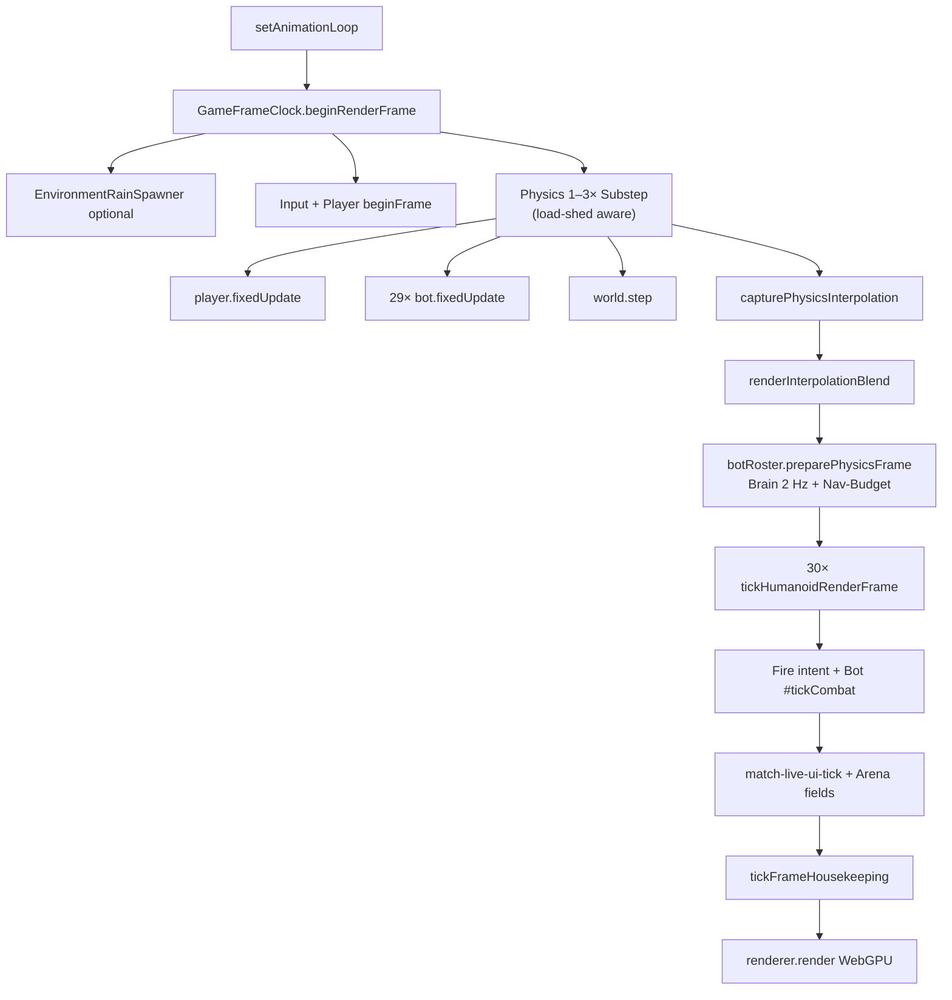

# Tick-Architektur — Ist-Stand

Referenz für den Main-Thread-Loop in FUNNEL: Orchestrator, Physics-Substeps, Humanoid-Render-Tick, Combat/VFX und HUD. Abnahme-Bar: **15v15 Pro-Roster** (29 Bots + Player) @ max refresh ohne Stutter.

**Code-Einstieg:** `src/app/funnel-app.ts` · **Frame-Clock:** `src/core/game-frame-clock.ts`

---

## Loop-Ablauf (pro Render-Frame)

```637:872:src/app/funnel-app.ts
  void renderer.setAnimationLoop((now) => {
    const renderTick = frameClock.beginRenderFrame(now);
    // ...
    beginNavRayBudgetFrame();
    // Rain, Input, player.beginFrame
    frameClock.accumulatePhysics(deltaSeconds);
    const physicsBatch = frameClock.consumePhysicsSteps((step) => {
      player.fixedUpdate(step, snapshot);
      botRoster.fixedUpdate(step, frameNowMs, botContextBase);
      world.step(eventQueue);
      player.capturePhysicsInterpolation();
      botRoster.capturePhysicsInterpolation();
      arena.dynamicInstances.capturePhysicsInterpolation();
    });
    botRoster.preparePhysicsFrame(..., physicsBatch.loadShedNonCritical);
    // Interpolation-Blend → Player + Bots + Dynamic Instances
    player.afterPhysics();
    botRoster.afterPhysics();
    const frame = player.finishFrame(...);          // tickHumanoidRenderFrame
    botRoster.update(...);                          // 29× tickHumanoidRenderFrame + Combat
    tickMatchLiveReviveHire(...);
    matchLiveUi.tick(...);
    // Fire intent, tickFrameHousekeeping, render
  });
```



| Phase | Modul | Frequenz |
|-------|--------|----------|
| Frame-Clock | `game-frame-clock.ts` | 1× / rAF (ggf. gedrosselt via `maxRenderHz`) |
| Physics-Substep | Player + Bots + Rapier | 1–3× / Frame (`physicsMaxSubSteps`) |
| Bot-Brain | `bot-brain.ts` | **2 Hz** (`botBrainTickHz`) |
| Bot-Navigation-Refresh | `bot-navigation-cache.ts` | budgetiert, max **3 Refreshes/Frame** |
| Humanoid-Render | `humanoid-actor-tick.ts` | 30× / Frame (Player + 29 Bots) |
| Team-Presence-Score | `team-presence-scoring.ts` | 1 Hz |
| World-Effects | `world-effects-registry.ts` | 1× / Frame, nur aktive Sources |
| HUD | `match-live-ui-tick.ts` | 1× / Frame, DOM dirty-gated |

---

## Parameter

| Parameter | Wert | Quelle |
|-----------|------|--------|
| `fixedStep` | 10 ms | `PHYSICS_CONFIG.fixedStep` |
| `maxSubSteps` (Config-Fallback) | 6 | `PHYSICS_CONFIG.maxSubSteps` |
| **Runtime `physicsMaxSubSteps`** | **3** | `chrome-macos-arm-profile.ts` → `GameFrameClock` |
| Delta-Clamp | 50 ms | `GameFrameClock` (`MAX_FRAME_DELTA_S`) |
| Adaptives Substep-Budget | −1 bei ≥20 ms Frame, −2 bei ≥28 ms | `GameFrameClock.recordFrameWallMs` |
| Bot-Brain | **2 Hz** | `botBrainTickHz` |
| Nav-Ray-Budget | **3/Frame** | `navRayBudgetPerFrame` |
| Route-Steer-Fan-Budget | **10/Frame** | `routeSteerFanBudgetPerFrame` |
| Shadows (Runtime) | **aus** | `shadowsEnabled: false`, Map 512 Fallback |
| Rain-Stückzahl | ×**0.35** | `rainWaveCountScale` |
| Rain-Spawn-Intervall | ×**2** (Basis 50 ms) | `rainDropIntervalScale` + `BASE_DROP_INTERVAL_S` |
| Pro-Roster | **15 + 15 = 29 Bots** | `playersPerTeam: 15` |

Load-Shedding (`physicsBatch.loadShedNonCritical`): bei Physics-Backlog oder engem Frame-Budget werden **nicht-kritische** Bot-Pfade übersprungen (`preparePhysicsFrame`: kein Brain/Nav-Refresh/Jump-Probe) und World-Effects dürfen Spawn/Sync drosseln — Lifecycle-Ticks (Impact-TTL, Flash-Sweep) laufen weiter (`frame-housekeeping.ts`).

---

## Tick-Module (Dateien)

| Datei | Aufgabe |
|-------|---------|
| `src/app/funnel-app.ts` | Loop-Orchestrator |
| `src/core/game-frame-clock.ts` | Delta, Substeps, Interpolation-Blend, Load-Shed-Flag |
| `src/core/frame-housekeeping.ts` | Audio + Segment-Lines + `tickAllWorldEffects` |
| `src/combat/humanoid-actor-tick.ts` | Gemeinsamer Render-Tick Player + Bots |
| `src/app/match-live-ui-tick.ts` | HUD, Scoring, Death-Respawn, Revive/Hire |
| `src/combat/team-presence-scoring.ts` | 1 Hz Territory-Punkte |
| `src/bots/bot-nav-ray-budget.ts` | Nav-/Route-Steer-Budget pro Frame |
| `src/bots/bot-navigation-cache.ts` | Nav-Accumulator, Phase-Offset, Budget-Gate |
| `src/bots/bot-roster.ts` | Bot-Loops (fixed, prepare, update, jump pads) |
| `src/combat/world-effects-registry.ts` | Zentraler VFX/Combat-Tick (`needsWorldTick`) |
| `src/combat/world-projectile-sim.ts` | Shared Projektil-Sim (1 Source) |
| `src/combat/weapon-arsenal.ts` | Pro Actor 1 Source (Hitscan, Bursts, Ammo) |

**World-Effects-Sources:** 1× `WorldProjectileSim` + 30× `WeaponArsenal` (Player + 29 Bots). Idle-Sources werden via `needsWorldTick()` übersprungen.

---

## Bereits umgesetzte Optimierungen

### Frame-Clock & Physics

- `GameFrameClock` statt inline Accumulator in `funnel-app.ts`
- Runtime-Substeps **3** statt Config-6; adaptives Herunterfahren bei schweren Frames
- **Render-Interpolation** zwischen Physics-States (`physics-interpolation.ts`, `capturePhysicsInterpolation` + Blend auf Player, Bots, Rain-Bodies)
- Accumulator-Cap (`MAX_PHYSICS_REMAINDER_MULTIPLIER`) statt hartem Reset auf 0

### Bot-AI & Navigation

- **Phase-Offset** pro Bot bei `BotNavigationCache.reset(slot, slotCount)` — kein Thundering-Herd mehr beim Spawn
- **Nav-Ray-Budget:** max 3 `fillBotNavigationGoal`-Refreshes pro Frame (`tryAcquireNavRayRefresh`)
- Route-Steer-Fan budgetiert (`tryAcquireRouteSteerFanRefresh`)
- Brain @ **2 Hz** statt ~12 Hz
- LoS-Raycast nur beim Brain-Step (~2 Hz/Bot), nicht pro Physics-Substep
- **`RAPIER.Ray`-Reuse** in `bot-navigation.ts` und `bot-perception.ts` (Modul-Scratch)

### GC / Hot Path

- Kein `projectile.position.clone()` mehr im Projektil-Tick
- Rain-Spawn: Modul-Scratch `_spawnEuler` / `_spawnQuaternion`
- Target-Snapshots: `BotTargetSnapshotCache` patcht Positionen in-place statt pro Frame neu zu allokieren
- HUD: Health/Ammo/Weapon-Bar mit Revision/State-Keys
- Intrusion-Pressure: `IntrusionPressureCache` einmal pro `renderFrameId`
- Muzzle-Scratch in `funnel-app.ts` (`_muzzlePosition`)

### Combat / VFX

- `tickAllWorldEffects` mit `needsWorldTick()`-Gate
- `loadShedNonCritical` an Projektil-Spawn/Sync (nicht an Lifecycle)
- Instancing + gepoolte Lights/Trails (siehe `docs/Instancing.md`)

### Rain

- Wellen-Stückzahl ×0.35, Spawn-Intervall ×2 (Runtime-Profil)
- `dynamicInstances.sync()` überspringt sleeping Bodies

---

## Bekannte verbleibende Hebel (priorisiert)

| Priorität | Thema | Detail |
|-----------|--------|--------|
| **Mittel** | Distant-Bot-Anim-LOD | `#visualReducedLod` (>46 m) skippt Mesh/Eye/Aim-Spine, **Mixer tickt trotzdem** @ vollem Refresh — größter verbleibender CPU-Block im Humanoid-Pfad unter vollem Roster |
| Niedrig | Footsteps aller Bots | `#tickFootsteps` ohne Distanz-LOD |
| Niedrig | World-Effects Fan-out | 30× `WeaponArsenal` in Registry — funktional ok, DRY-Refactor möglich (ein Roster-Pass) |
| Niedrig | `player.position()` | allokiert `Vector3`, kein Hot-Path-Caller |
| Roadmap | GPU-Particles / Clustered Lights | off hot path (Skill) |

Unter **Chrome + M1 + Pro-Roster** ist der Loop heute stabil; die Tabelle oben sind Feintuning-Kandidaten, keine akuten Freeze-Ursachen.

---

## Stress-Checkliste (Abnahme)

1. Volles Pro-Roster (**15v15**) + sustained fire aller Waffen
2. Sprint + Jump + Crouch gleichzeitig
3. Erste Rain-Phase nach Map-Reveal (gedrosselt, aber noch spürbar)
4. Tab-Wechsel zurück (Delta-Clamp → bis 3 Substeps)
5. Performance Panel: kein GC-Sägezahn im Humanoid-/Nav-Pfad; p99 Frame Time stabil

```bash
npm run lint && npm run build
# Browser: http://localhost:3011/
```

---

## Historische Analyse

Frühere sporadische Freezes (Nav-Ray-Herd @ ~12 Hz Brain, 6 Substeps, fehlende Interpolation, ungebremster Rain) sind durch die oben genannten Maßnahmen adressiert. Alte Hypothesen (z. B. `new Vector3` in `bot-perception`, `new RAPIER.Ray` pro Probe, Team-HUD als Spike-Ursache) gelten **nicht mehr** für den aktuellen Code.

Offene Roadmap-Punkte siehe Abschnitt **Bekannte verbleibende Hebel**.
