# Analyse: sporadische Freezes / unsaubere Ticks

Das Problem passt zum aktuellen Loop-Design: **ein Frame kann mehrere Physics-Substeps ausführen**, und mehrere schwere Systeme laufen **synchron auf dem Main Thread**. Wenn ein Frame zu lang wird, folgt oft der nächste Hänger — nicht immer ein klassischer „Spiral of Death“, aber sichtbare Ruckler.

## Wie der Loop heute tickt

```222:265:src/app/funnel-app.ts
  void renderer.setAnimationLoop(() => {
    const now = performance.now();
    const deltaSeconds = Math.min((now - lastFrameAt) / 1000, 0.05);
    lastFrameAt = now;
    // ... input, HUD, Waffen ...
    accumulator += deltaSeconds;
    let subSteps = 0;
    while (accumulator >= PHYSICS_CONFIG.fixedStep && subSteps < PHYSICS_CONFIG.maxSubSteps) {
      player.fixedUpdate(PHYSICS_CONFIG.fixedStep, snapshot);
      botRoster.fixedUpdate(PHYSICS_CONFIG.fixedStep, { /* ... */ });
      world.step(eventQueue);
      accumulator -= PHYSICS_CONFIG.fixedStep;
      subSteps += 1;
    }
    if (subSteps === PHYSICS_CONFIG.maxSubSteps) {
      accumulator = 0;
    }
```

| Parameter | Wert | Bedeutung |
|-----------|------|-----------|
| `fixedStep` | 10 ms | Physics-Tick |
| `maxSubSteps` | 6 | max. **60 ms Physics pro Render-Frame** |
| Delta-Clamp | 50 ms | lange Pausen (Tab-Wechsel) werden abgeschnitten |

```mermaid
flowchart TD
  RAF[requestAnimationFrame] --> Delta[delta clamp 50ms]
  Delta --> Rain[Rain Spawner]
  Delta --> SubLoop{bis 6× Physics}
  SubLoop --> Player[Player fixedUpdate]
  SubLoop --> Bots[29× Bot fixedUpdate]
  SubLoop --> Rapier[world.step]
  SubLoop --> SubLoop
  SubLoop --> Render[WebGPU render 512 shadow]
```



**Kein Render-Interpolation** zwischen Physics-States (laut Skill/Roadmap geplant) — bei Substep-Bursts wirkt Bewegung zusätzlich ruckelig, auch wenn die FPS-Zahl noch halbwegs ok aussieht.

---

## Hauptverdächtige (nach Wahrscheinlichkeit)

### 1. Bot-Navigation: Raycast-Stürme (sehr wahrscheinlich)

Dev-Roster: **14 + 15 = 29 Bots** (`match-roster.ts` ← `playersPerTeam: 15`, alle Profile).

Pro Nav-Refresh im `seek`-Modus:
- **11 Richtungs-Probes** × pro Richtung **5 Boden-Raycasts + 5 Overhead-Raycasts** ≈ **~110 `castRay`-Aufrufe pro Bot**

Refresh-Rate: ~12 Hz (`BOT_BRAIN_STEP_S`). Theoretisch **~25.000 Raycasts/Sekunde** wenn alle gleichzeitig unterwegs sind.

**Thundering-Herd:** Alle Bots spawnen zusammen → `navigation.reset()` zur gleichen Zeit → **Accumulator phasengleich**. Alle 29 (Pro) können im **selben Physics-Substep** refreshen:

> **29 × 110 ≈ 3.190 Raycasts in einem 10-ms-Tick**

Das erklärt **„ab und zu“** gut: Freeze alle ~80–120 ms, verstärkt wenn viele Bots **PUSH/HUNT** fahren (nicht FIGHT/stehen).

Zusätzlich: **pro Substep pro Bot** ein LoS-Raycast in `#buildBrainInput` → weitere **~29 Raycasts/Substep** wenn Gegner da sind.

### 2. Physics-Substep-Multiplikator bei Hängern

Ein langsamer Frame (z. B. durch Nav-Burst) triggert bis zu **6×**:
- Player + 29 Bots `fixedUpdate` (Brain, Waffen, Drive)
- `world.step` auf wachsender Collider-Menge

Der Accumulator-Reset bei `maxSubSteps` verhindert Endlosschleifen, **bügelt aber nicht die Kosten eines einzelnen Frames glatt** — der Frame bleibt schwer.

### 3. Rain-Spawner am Match-Start (~2 s kritisch)

```9:9:src/arena/environment-rain-spawner.ts
const DROP_INTERVAL_S = 0.02;
```

**105 Teile** in ~2,1 s → **50 neue Rapier-Bodies/Sekunde**, plus `castShadow: true` auf InstancedMeshes. Rain startet schon **vor** dem Countdown (`rainSpawner.start()` direkt nach `revealMap()`).

Typisches Muster: Ruckler **gleich nach Map-Reveal / Countdown**, dann etwas ruhiger — bis Bots aktiv navigieren und schießen.

### 4. GC-Micro-Spikes (verstärkend, selten allein Ursache)

Hot-Path-Allokationen trotz Performance-Regeln:

| Stelle | Problem |
|--------|---------|
| `bot-perception.ts` | `new Vector3()` in `botEyePosition` / `botAimPoint` — **jeder Bot, jeder Physics-Step** |
| `bot-navigation.ts` | `new RAPIER.Ray(...)` pro Probe |
| `weapon-arsenal.ts` | `projectile.position.clone()` pro Projektil pro Frame |
| `environment-rain-spawner.ts` | `new Quaternion()` + `new Euler()` pro Drop |

Allein selten freeze-würdig; **zusammen mit Raycast-Bursts** → GC-Pause genau im falschen Moment.

### 5. 20× WeaponArsenal im Render-Pfad

Player + 29 Bots: `tickHumanoidRenderFrame` → `weapon.tickWorld` wenn Projektile/VFX aktiv. Bot-Budget ist klein (8 Projektile), Player bis 96 — bei Feuergefecht summiert sich `#updateProjectiles` mit Ray-Marches.

### 6. GPU: konstant schwer, nicht intermittent

**512×512 Shadow Map** (Fallback-Profil; M1-Target: shadows off), jedes Frame neu fokussiert auf Spieler-Position. Kostet FPS, erklärt aber eher **dauerhaft niedrige Basis-FPS**, nicht sporadische 200-ms-Freezes.

### 7. Grunt-TTS (eher Mikroruckler)

`playText()` baut synchron viele AudioNodes auf dem Main Thread — bei Jump/Land-Grunts spürbar, aber kein typischer 100-ms-Freeze.

---

## Wann es am ehesten passiert

| Situation | Warum |
|-----------|--------|
| **Erste ~5 s nach Map-Reveal** | Rain spawnt 105 Bodies |
| **Countdown → Match live** | Input + 29 Bots (Pro) + Rain-Kollisionen gleichzeitig |
| **Alle Bots laufen (PUSH/HUNT)** | Nav-Raycast-Herd alle ~80 ms |
| **Feuergefecht + Bewegung** | Projektile + Substeps + Raycasts |
| **Tab-Wechsel zurück** | Delta-Clamp → 6 Substeps auf einmal |

---

## Was es wahrscheinlich *nicht* ist

- **Team-HUD** — schreibt jedes Frame DOM, aber trivial im Vergleich zu 2000 Raycasts
- **Reines Render-Limit** — wäre eher konstant, nicht rhythmisch
- **AudioContext resume** — einmalig beim Start

---

## Nächste Schritte (priorisiert)

1. **Instrumentieren** — im Loop Substep-Zähler, Framezeit, Nav-Refresh-Zähler, Raycast-Zähler (1 kleines Modul, nur Dev-Build)
2. **Nav-Refresh entphasen** — pro Bot zufälliger Phase-Offset in `BotNavigationCache.reset()` (minimaler Fix, große Wirkung)
3. **Ray-Reuse** — `RAPIER.Ray` + `Vector3` scratch statt `new` in `bot-navigation` / `bot-perception`
4. **Dev-Bot-Count reduzieren** — zum Isolieren von Nav-Kosten temporär `playersPerTeam` in `chrome-macos-arm-profile.ts` senken; Abnahme bleibt **15v15**
5. **Rain an Countdown koppeln + Spawn-Rate drosseln** — laut `docs/environment-dynamic.md` ohnehin geplant

Wenn du willst, setze ich als Nächstes **(a)** ein leichtgewichtiges Tick-Profiler-Overlay oder **(b)** direkt den Nav-Phase-Offset + Ray-Scratch-Fix um — beides sind kleine, gezielte Diffs mit hoher Diagnose-/Fix-Wirkung.