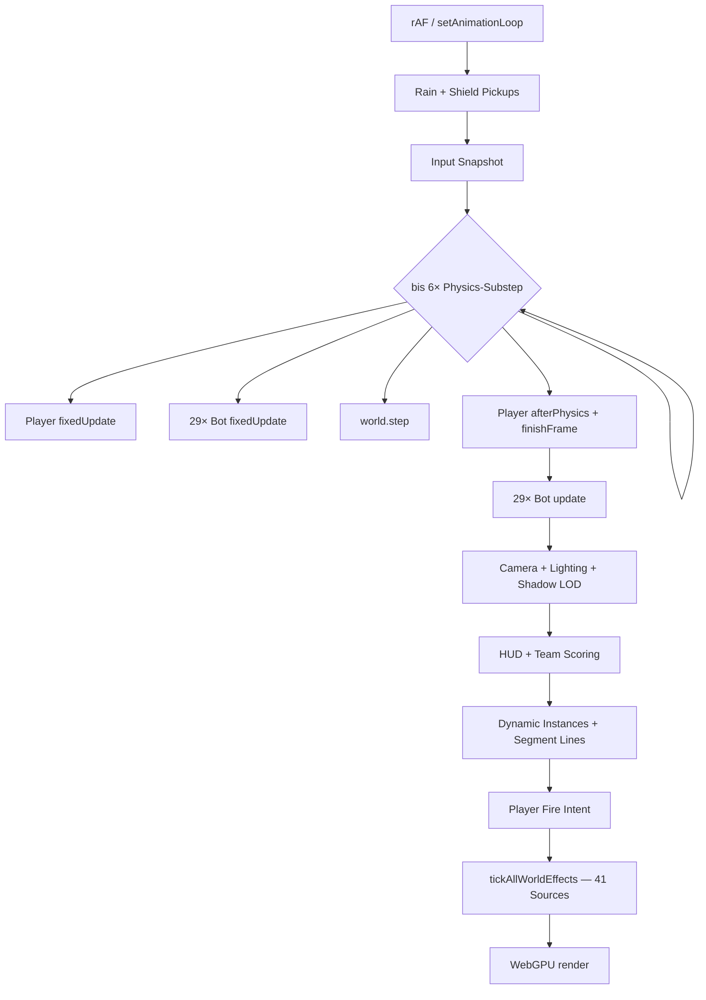

## Game-Loop-Analyse

Der Loop in `funnel-app.ts` ist sauber als Orchestrator aufgebaut — Input → Physics-Substeps → Post-Physics → Combat/VFX → Render. Das ist die richtige Architektur. Der Engpass liegt nicht in der Struktur, sondern in der **Kosten-Skalierung**: **29 Bots** (Pro **15v15**) × Physics-Substeps × Raycasts × 40 Weapon-Arsenals summieren sich zu sporadischen Frame-Spikes.

Es gibt bereits eine gute Basis in `docs/ticks.md`. Stand heute:

| Parameter | Aktuell (Pro) |
|-----------|---------|
| Dev-Roster | **14 + 15 = 29 Bots** (`match-roster.ts` ← `playersPerTeam: 15`) |
| Abnahme-Bar | **15 Mitglieder pro Teamseite** (`playersPerTeam: 15`) |
| Physics | `fixedStep` 10 ms, max **6 Substeps** (= 60 ms Physics/Frame) |
| Delta-Clamp | 50 ms |
| Shadow Map | **512×512** (`create-scene.ts`) |
| WorldEffects-Sources | **41** (1 `WorldProjectileSim` + 40 `WeaponArsenal`) |

---

### Loop-Ablauf (pro Frame)



---

## Kosten nach Schweregrad

### 🔴 Kritisch — sporadische Freezes (100–300 ms)

**1. Bot-Navigation: Raycast-Stürme**

Pro Nav-Refresh (`seek`-Phase, ~12 Hz):
- **11 Richtungs-Probes** × (5 Clearance-Rays + 5 Headroom-Rays) ≈ **110 `castRay`/Bot**

Bei 29 gleichzeitig refreshenden Bots in **einem** Physics-Substep:

> **29 × 110 ≈ 3.190 Raycasts in 10 ms**

Das erklärt rhythmische Ruckler alle ~80–120 ms — besonders wenn viele Bots **PUSH/HUNT** fahren.

Zusätzlich **pro Substep pro Bot**:
- `#buildBrainInput` → LoS-Raycast wenn Gegner da (~29 Rays/Substep)
- `resolveNearestHostileTarget` über 30 Kandidaten (billig, aber 29× pro Substep)

`BotNavigationCache` hat bereits Phase-Spread (`NAV_REFRESH_PHASE_SPREAD_S`), aber bei Match-Start spawnen alle gleichzeitig → Herd-Risiko bleibt.

**2. Physics-Substep-Multiplikator**

Bei einem langsamen Frame (z. B. Nav-Burst) laufen bis zu **6×**:
- Player + 29 Bots `fixedUpdate` (Brain, Navigation, Movement)
- `world.step` auf wachsender Collider-Menge (Rain: bis 105 Bodies)

```269:295:src/app/funnel-app.ts
    accumulator += deltaSeconds;
    let subSteps = 0;
    while (accumulator >= PHYSICS_CONFIG.fixedStep && subSteps < PHYSICS_CONFIG.maxSubSteps) {
      player.fixedUpdate(PHYSICS_CONFIG.fixedStep, snapshot);
      // ...
      botRoster.fixedUpdate(PHYSICS_CONFIG.fixedStep, { /* ... */ });
      world.step(eventQueue);
      accumulator -= PHYSICS_CONFIG.fixedStep;
      subSteps += 1;
    }

    if (subSteps === PHYSICS_CONFIG.maxSubSteps) {
      accumulator = 0;
    }
```

Der Accumulator-Reset verhindert Spiral-of-Death, **glättet aber nicht** die Kosten eines einzelnen schweren Frames.

**3. Rain-Spawner (~2 s kritisch nach Map-Reveal)**

```9:9:src/arena/environment-rain-spawner.ts
const DROP_INTERVAL_S = 0.02;
```

105 Teile in ~2,1 s → **50 neue Rapier-Bodies/Sekunde**. Rain startet **vor** dem Countdown (`rainSpawner.start()` direkt nach `revealMap()`). Jedes Teil triggert `arena.dynamicInstances.sync()` über alle aktiven Slots.

---

### 🟠 Hoch — dauerhafte CPU-Last, verstärkt unter Stress

**4. Doppelte Target-Snapshot-Allokation pro Frame**

```117:137:src/bots/bot-roster.ts
  fixedUpdate(fixedStep: number, context: Omit<BotCombatContext, 'targets'>): void {
    const combatContext: BotCombatContext = {
      ...context,
      targets: this.#buildTargetSnapshots(context.player)  // ← neues Array
    };
    // ...
  }

  update(deltaSeconds: number, nowMs: number, context: Omit<BotCombatContext, 'targets'>): void {
    const combatContext: BotCombatContext = {
      ...context,
      targets: this.#buildTargetSnapshots(context.player)  // ← nochmal
    };
```

2× pro Frame × ~40 Einträge = **80 Allokationen/Frame** nur für Target-Listen. Cachebar über den Frame hinweg.

**5. 40× Humanoid-Render-Tick**

Pro Frame (Player + 29 Bots):
- `AnimationMixer.update`
- `syncHumanoidVisualRoot`
- `WeaponArsenal.prepareWorldTickContext`
- Bot: `#tickCombat` mit Fire-Intent, Audio, Secondary-Logic

In `humanoid-actor-tick.ts` zusätzlich Object-Spread pro Actor:

```47:50:src/combat/humanoid-actor-tick.ts
  context.updateLocomotion(deltaSeconds, {
    ...context.buildLocomotion(),
    fireStarted: weapon.consumeFireStarted()
  });
```

**6. `tickAllWorldEffects` — 41 Sources**

```18:24:src/combat/world-effects-registry.ts
export function tickAllWorldEffects(nowMs: number, deltaSeconds: number): void {
  for (const source of SOURCES) {
    if (!source.needsWorldTick(nowMs)) {
      continue;
    }
    source.tickWorld(nowMs, deltaSeconds);
  }
}
```

40 `WeaponArsenal`-Instanzen registriert — auch im Idle wird `needsWorldTick()` geprüft. Bei Feuergefecht: zentraler `WorldProjectileSim` + 40 Hitscan-Instanzen.

**7. Mehrfache Registry-Scans pro Frame (match live)**

| Call | Wann | Kosten |
|------|------|--------|
| `countIntrusionPressure` | jedes Frame | O(40 Actors) |
| `countTeamRosterMembers` | jedes Frame via `refreshTeamHud` | O(40) |
| `tickTeamPresenceScoring` | jede volle Sekunde | O(40) |

DOM-Writes im Team-HUD sind trivial — die **Registry-Iterationen** sind es nicht, wenn man sie jedes Frame 2× macht.

---

### 🟡 Mittel — GC-Spikes, skaliert mit Aktivität

| Stelle | Problem |
|--------|---------|
| `funnel-app.ts:377` | `new Vector3()` für Muzzle **jedes Frame** |
| `player-camera.ts:201` | `new Vector3(0, eyeHeight, 0)` in `#updatePivot` |
| `world-projectile-sim.ts:1105` | `#removeProjectileAt` nutzt **`splice`** statt swap-pop |
| `world-projectile-sim.ts:402` | `position.clone()` beim Spawn |
| `environment-rain-spawner.ts:17-24` | `new Quaternion()` + `new Euler()` pro Drop |
| `bot-route-clearance.ts:41` | `.map()` erzeugt Array pro Headroom-Probe |

Allein selten freeze-würdig — **zusammen mit Raycast-Bursts** treffen GC-Pausen genau den falschen Moment.

---

### 🟢 Niedrig — konstante Baseline, kein Spike-Muster

- **Shadow 512×512** mit fokussiertem Frustum (22 m) — gut optimiert
- **ShadowLodController** — 12 Subjects/Frame Round-Robin
- **Instancing** für Projektile, Rain, Arena-Statics — korrekt
- **Kein Render-Interpolation** — Roadmap-Item; erklärt Ruckeln bei Substep-Bursts, nicht Freezes

---

## Wann es am ehesten passiert

| Situation | Mechanismus |
|-----------|-------------|
| Erste ~5 s nach Map-Reveal | Rain: 50 Bodies/s + Physics-Kollisionen |
| Countdown → Match live | Input + 29 Bots aktiv + Rain |
| Alle Bots laufen (PUSH/HUNT) | Nav-Herd ~4.000 Rays/Substep |
| Feuergefecht + Bewegung | Projektile + Substeps + Raycasts |
| Tab-Wechsel zurück | Delta-Clamp → 6 Substeps auf einmal |

---

## Priorisierte Optimierungs-Roadmap

### Phase 1 — Messen (1 kleines Modul, Dev-only)
Frame-Profiler mit:
- `subSteps`, Framezeit (ms)
- Nav-Refresh-Zähler + Raycast-Zähler (Counter in `bot-navigation`)
- `SOURCES.size`, aktive Projektile
- Optional: Overlay im Canvas

**Baseline** unter Stress: sustained fire + sprint + **volles Pro-Roster (15v15)** @ max refresh.

### Phase 2 — Quick Wins (hohe Wirkung, kleiner Diff)
1. **Target-Snapshots einmal pro Frame cachen** (`bot-roster.ts`)
2. **Team-HUD nur bei Änderung** updaten (nicht jedes Frame `countTeamRosterMembers`)
3. **Scratch-Vektoren** in `funnel-app.ts` + `player-camera.ts`
4. **Rain an Countdown koppeln** + Spawn-Rate drosseln
5. **Dev-Bot-Count** temporär auf 2+3 reduzieren zum Verifizieren

### Phase 3 — Strukturell (größter FPS-Gewinn)
1. **Nav-Ray-Budget pro Frame** — max N Refreshes/Frame statt Herd
2. **Bot fixedUpdate aus Substep entkoppeln** wo möglich (Brain/Nav @ 12 Hz, Physics @ 100 Hz)
3. **WorldEffects konsolidieren** — ein zentraler Tick statt 40 `WeaponArsenal.needsWorldTick`-Checks
4. **Registry-Scans batchen** — ein `MatchFrameContext` pro Frame mit gecachten Counts
5. **Render-Interpolation** zwischen Physics-States (Roadmap)

### Phase 4 — Combat/VFX
- `splice` → swap-pop in `world-projectile-sim.ts`
- Player/Bot shared tick path wo sinnvoll (`humanoid-actor-tick` erweitern)

---

## Empfohlene Baseline-Messung

Im Browser (Performance Panel):
1. **Idle** — Map geladen, Countdown, keine Bewegung
2. **Rain-Phase** — erste 5 s nach Reveal
3. **Match live, stehend** — nur HUD/Scoring
4. **Sprint + Feuer** — Player solo
5. **Volles Pro-Roster (15v15) + Feuergefecht** — Worst Case / Abnahme

Pro Szenario notieren: avg Frame Time, p99, GC-Spikes, `subSteps`-Max.

---

`docs/ticks.md` deckt die Hauptursache (Nav-Raycasts) — Pro-Roster **29 Bots**, Shadow **512×512**.

Womit soll ich als Nächstes starten?

- **(a)** Dev-Profiler-Overlay (Mess-Modul)
- **(b)** Quick Wins (Target-Cache, HUD-Throttle, Vector-Scratch)
- **(c)** Nav-Ray-Budget / Phase-Entkopplung