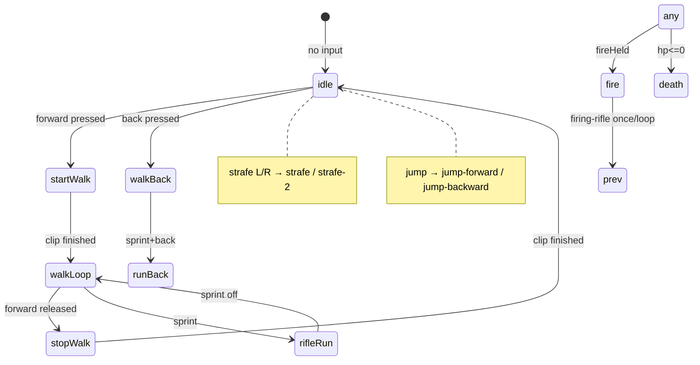

## Ist-Zustand (Code-Review) — aktualisiert 2026-05-22

**Phase 0 + Phase 1 erledigt.** Spieler lädt Shooter-Pack Collada statt FBX.

| Bereich | Status |
|--------|--------|
| Loader | `loadShooterPackCharacter()` → `animation-model-y-bot.dae` + 15 ZIP-DAEs |
| Clips | `AnimationClipRegistry` — clip ids aus Dateiname (`walking`, `rifle-run`, …) |
| Remap | `collada-animation-remap.ts` — UUID-Tracks → `mixamorig_*` Bone-Namen |
| State-Machine | Erste Zuordnung in `player-visual.ts` → Shooter-Pack ids (FSM Phase 3 offen) |
| Inspect | `npm run inspect:shooter-pack` — `docs/animations.txt`, `docs/bones.txt` (65 bones, 15 clips, compatible) |

Module: `collada-zip.ts`, `collada-asset-loader.ts`, `shooter-pack-loader.ts`, `shooter-pack-paths.ts`, `animation-clip-registry.ts`, `collada-inspector.ts`, `skeleton-validation.ts`.

**Asset-Format (wichtig für die Umsetzung):**

- `animation-model-y-bot.dae` → echtes **XML-Collada**, `Y_UP`, `unit meter="0.01"` (Mixamo/cm).
- Alle **15 Animations-DAEs** → faktisch **ZIP-Archive** (Header `PK…`), innen eine `.dae` — `ColladaLoader` parst nur XML-Text, **nicht** ZIP. Vor dem Parse muss entpackt werden (z. B. `fflate`, wie bei `KMZLoader`).

**Vorhandene Clips (15 Animationen + 1 Mesh):**

| Datei | Geplante Rolle |
|-------|----------------|
| `animation-model-y-bot.dae` | Rig + Mesh |
| `animation-rifle-aiming-idle.dae` | Idle (Waffe) |
| `animation-walking.dae` | Vorwärts gehen |
| `animation-rifle-run.dae` | Vorwärts laufen / Sprint |
| `animation-start-walking.dae` | Einmalig: Walk-Start |
| `animation-stop-walking.dae` | Einmalig: Walk-Stopp |
| `animation-walking-backwards.dae` | Rückwärts gehen |
| `animation-run-backwards.dae` | Rückwärts laufen |
| `animation-start-walking-backwards.dae` | Einmalig: Rückwärts-Start |
| `animation-walk-backwards-stop.dae` | Einmalig: Rückwärts-Stopp |
| `animation-strafe.dae` / `animation-strafe-2.dae` | Strafe links/rechts |
| `animation-jump-forward.dae` / `animation-jump-backward.dae` | Sprung je nach Bewegungsrichtung |
| `animation-firing-rifle.dae` | Schießen |
| `animation-walking-to-dying.dae` | Tod (noch kein Gameplay-Hook) |

**Lücken vs. aktueller Controller** (`player-controller.ts`):

- Keine Crouch-/Slide-Clips im Pack → heute `crouch*`, `slide` → **Fallback** (z. B. idle/walk), bis du neue Mixamo-Clips nachlädst.
- Kein separates `shootCrouch` → Fallback auf `firing-rifle` oder idle.
- **Start/Stop-Walk** sind Übergangsclips — die aktuelle Logik (`#playState` + sofortiger Crossfade) reicht dafür **nicht**; es braucht eine kleine Locomotion-FSM mit `LoopOnce` + Rückkehr zur Loop.

---

## Umsetzungsplan

### Phase 0 — Verifikation ✅

- `npm run inspect:shooter-pack` (`_Scripts/inspect-shooter-pack.mjs`)
- Base: XML Collada, `unit meter="0.01"` — **kein** extra `scale 0.01` wie beim alten FBX
- Animations-DAEs: ZIP → inneres XML → `ColladaLoader`
- UUID-Track-Remap auf Bone-Namen (sonst 52/65 incompatible)

Ergebnis: `docs/animations.txt`, `docs/bones.txt` (alle 15 clips `compatible=true`).

---

### Phase 1 — Loader-Infrastruktur ✅

```
src/player/
  collada-zip.ts               # PK erkennen → unzip → inneres .dae XML
  collada-asset-loader.ts      # fetch + ColladaLoader.parse
  collada-animation-remap.ts   # UUID tracks → mixamorig bone names
  shooter-pack-loader.ts       # Base + N Animation-URLs parallel laden
  shooter-pack-paths.ts        # URLs + SHOOTER_PACK_ANIMATION_FILES
  animation-clip-registry.ts   # clipId → AnimationClip / AnimationAction
  collada-inspector.ts         # Browser console validation
  skeleton-validation.ts
  locomotion-anim-controller.ts  # Phase 3 — noch offen
  player-visual.ts             # State → clip id mapping
```

**`collada-zip.ts`**

- `fetch` → `ArrayBuffer`
- Wenn ZIP: `unzipSync` (three `fflate`), erste `.dae`-Datei extrahieren
- `ColladaLoader.parse(xml, basePath)` → `{ scene, animations }`
- Animation-Loads: **Scene verwerfen**, nur `animations[]` behalten

**Clip-ID-Konvention (erweiterbar):**

- Aus Dateiname: `animation-walking.dae` → `walking`
- Registry: `Map<string, AnimationClip>`
- Clip im Mixer umbenennen: `clip.name = clipId` (Collada-Namen sind oft generisch)

---

### Phase 2 — Manifest / neue Downloads ✅

- `shooter-pack-manifest.ts` — `import.meta.glob('../../public/Shooter-Pack/animation-*.dae')` (Build-Zeit, keine Handliste).
- `shooter-pack-bindings.ts` — bekannte clipId → Rolle; unbekannte Clips werden in der Konsole geloggt.
- `vite.config.ts` — `assetsInclude: ['**/*.dae']`.
- Neue Datei: `animation-<name>.dae` in `public/Shooter-Pack/` legen → nach Dev-Neustart/Build automatisch laden; optional Binding in `shooter-pack-bindings.ts` + FSM.

---

### Phase 2 — Manifest / neue Downloads (Referenz)

Zwei Wege (empfohlen: **beides**):

1. **Build-Zeit-Auto-Discovery** (Vite):

```ts
const urls = import.meta.glob('/Shooter-Pack/animation-*.dae', {
  eager: true,
  query: '?url',
  import: 'default'
});
// `animation-model-y-bot` ausfiltern
```

→ Neue Datei in `public/Shooter-Pack/` mit Naming `animation-*.dae` wird beim nächsten Build automatisch geladen.

2. **Optionales Mapping** `shooter-pack-bindings.ts`:

```ts
// clipId → wie im Spiel verwendet (role / state group)
export const CLIP_BINDINGS = { walking: 'locomotion.forwardWalk', ... };
```

Unbekannte Clips: laden + `console.info` mit Liste „unbound clips“ — nichts geht verloren.

**Workflow für dich:** Mixamo download → umbenennen (`animation-neuer-name.dae`) → in Ordner legen → optional Eintrag in `CLIP_BINDINGS` → fertig.

Optional später: `npm run scan:shooter-pack` schreibt Manifest + Doc-Tabelle.

---

### Phase 3 — Locomotion-FSM ✅ (2026-05-22)

Implementiert in `locomotion-anim-controller.ts`:

- Root-Motion-Fix: `mixamorig_Hips.position` wird beim Laden entfernt (`collada-strip-root-motion.ts`) + Mesh jedes Frame am Capsule verankert (`player-visual.#anchorCharacterToCapsule`) — behebt „Model läuft davon“.
- Vorwärts: `start-walking` → `walking` → `stop-walking`; Shift → `rifle-run`.
- Rückwärts: `start-walking-backwards` → `walking-backwards` / `run-backwards` → `walk-backwards-stop`.
- Strafe: `strafe` / `strafe-2` (bei Bedarf tauschen).
- Sprung: `jump-forward` / `jump-backward`.
- Schuss: `firing-rifle` einmal pro LMB-Druck (`fireStarted`).
- Crouch/Slide: Fallback `rifle-aiming-idle` (eigene Clips fehlen noch).

Feintuning: Crossfade/Strafe-Richtung (im Spiel testen).

---

### Phase 3 — Locomotion-FSM (Referenz / ursprünglicher Plan)

Erweiterung von `#animationState` / neuer Controller:



**Regeln (Vorschlag):**

| Input / Situation | Clip(s) |
|-------------------|---------|
| Still, grounded | `rifle-aiming-idle` (loop) |
| Forward, nicht sprint | `start-walking` → `walking` → `stop-walking` |
| Forward + sprint | `rifle-run` (loop) |
| Back | `start-walking-backwards` → `walking-backwards` oder `run-backwards` → `walk-backwards-stop` |
| Strafe L/R | `strafe` vs `strafe-2` (fest zuweisen, einmal testen welche Seite) |
| Luft + vorwärts / sonst | `jump-forward` / `jump-backward` (`LoopOnce`) |
| Fire (weapon mode) | `firing-rifle` (One-Shot oder kurzer Loop, danach locomotion) |
| Tod (später) | `walking-to-dying` (`LoopOnce`, clamp) |
| Crouch / Slide | Fallback bis neue Clips da sind |

`player-visual.ts`: Crossfade-Zeiten getrennt (locomotion 0.12s, transitions 0.05s, jump/fire sofortiger Wechsel).

---

### Phase 4 — Integration & Aufräumen (teilweise ✅)

- Spiel lädt nur noch Shooter-Pack Collada (`loadShooterPackCharacter`).
- Legacy `fbx-inspector.ts` nach `/_deleted/` verschoben.
- `public/model/` (FBX) bleibt im Repo, wird nicht mehr referenziert.

---

### Phase 5 — Controller-Erweiterungen ✅ (Basis)

- `player-health.ts` + `PLAYER_CONFIG.maxHealth`
- Tod: `walking-to-dying` über Locomotion-FSM wenn `health.isDead`
- **Test:** `K` = sterben, `R` = respawn am Spawn (Bewegung aus)
- Später: Schaden von Projektilen/Bots → `player.health.damage()`
- Sprint → `rifle-run` bereits in Phase 3
- Crouch/Slide-Clips: weiter Fallback bis Mixamo-Export

---

## Empfohlene Reihenfolge (Sprints)

| # | Inhalt | Ergebnis |
|---|--------|----------|
| 1 | Phase 0 + ZIP-Loader + Base-Mesh im Spiel | ✅ Y-Bot + idle (`rifle-aiming-idle`) |
| 2 | Registry + alle 15 Clips laden | ✅ `SHOOTER_PACK_ANIMATION_FILES` |
| 3 | Einfaches Mapping (idle, walk, run, back, strafe, jump, fire) | ✅ ersetzt durch FSM |
| 4 | FSM mit start/stop/back transitions | ✅ + Root-Motion-Strip |
| 5 | Death + `import.meta.glob` | ✅ |
| 6 | FBX-Code entfernt, Docs aktualisiert | ✅ (FBX-Dateien in `public/model/` optional löschen) |

---

## Risiken

1. **Doppelte Skalierung** — FBX `0.01` vs Collada `unit 0.01`; nach Phase 0 festlegen.
2. **ZIP-DAEs** — Mixamo-Animationsdateien sind ZIP; Erkennung per `PK` (Bytes `0x50 0x4B`), **nicht** per `uint32`-Vergleich (`0x50 << 24` ist in JS kaputt → Parser-Fehler „Start tag expected, '<' not found“ + blaue Fallback-Box). Fix in `collada-zip.ts`.
3. **Strafe-Richtung** — `strafe` vs `strafe-2` im Spiel testen und ggf. tauschen.
4. **Crouch/Slide** — bewusst Fallback, bis du weitere Mixamo-Exports hinzufügst.

---

Wenn du willst, starte ich mit **Phase 0 + Phase 1** (Loader + Base-Mesh im Spiel, erste Idle-Animation) — das ist der kleinste Schritt mit sofort sichtbarem Ergebnis. Oder wir tragen den Plan zuerst als Abschnitt in `docs/introduction.md` ein.