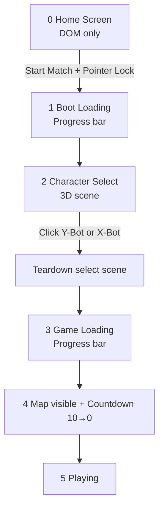

# FUNNEL — User Journey (Home → Character Select → Match)

Design-Spec für den **neuen Pre-Match-Flow**. Ersetzt die heutige Kombination aus Title-Screen + HTML-Character-Picker + Loader in einem Schritt.

**Referenzen:** `docs/introduction.md` §10, `docs/interface-ui.md` (Pre-Match), `docs/team-design.md` (Team-Blau), `docs/environment-dynamic.md` (Match-Flow), **`docs/home-screen.md`** (Home als eigene HTML-Seite + getrennter Loader).

**Ist-Code:** `src/ui/match-flow-screen.ts`, `src/app/funnel-app.ts`, `src/app/dom.ts`.

---

## 1. Ziel

| Heute | Neu |
|-------|-----|
| Home zeigt Infos **+** HTML-Buttons (Y-Bot / X-Bot) **+** Start Match | Home zeigt nur Infos, Quicktips und **einen** Start-Button |
| Klick auf Start → Loader → alles auf einmal | Klick auf Start → **Boot-Loader** → **3D-Character-Select** → **Game-Loader** → Arena |
| Character-Wahl per 2D-Button | Character-Wahl per **klickbare 3D-Figuren** mit Hover-Animation |
| Pointer Lock beim Start Match | Pointer Lock **beim Start Match** (unverändert — Audio-Gesture) |

Der Home Screen bleibt **leicht und sofort sichtbar** (kein WebGPU, kein Rapier, keine großen Assets). Erst der bewusste „Start Match“-Klick startet den schweren Boot-Pfad.

---

## 2. Phasen-Übersicht



| Phase | ID | UI | Canvas | Input |
|-------|-----|-----|--------|-------|
| **Home** | `home` | Vollbild DOM (`#preMatchHost`) | hidden | Maus frei |
| **Boot Loading** | `boot-loading` | Fortschrittsbalken + Label | hidden | gesperrt |
| **Character Select** | `character-select` | 3D-Szene + minimales Overlay | sichtbar | Maus frei (Raycast-Hover/Klick) |
| **Game Loading** | `game-loading` | Fortschrittsbalken + Label | hidden (oder darunter) | gesperrt |
| **Countdown** | `countdown` | Arena + Overlay 10→0 | sichtbar | gesperrt |
| **Playing** | `playing` | HUD | sichtbar | frei |

---

## 3. Phase 0 — Home Screen

### 3.1 Inhalt

Vollbild-Panel wie heute (`funnel-prematch-screen`), aber **ohne** Character-Picker und **ohne** Loading-Panel.

| Block | Inhalt |
|-------|--------|
| Kicker | `Arena shooter` |
| Brand | `FUNNEL` |
| Tagline | `HAVE FUN IN THE TUNNEL` |
| Steuerung | `<dl>` mit Move / Stance / Weapon / Pointer / Team / Dev (wie heute) |
| **Quicktips** | Neu: kompakte Liste mit **Title + Short Description** (2–4 Einträge, siehe §3.2) |
| CTA | Ein Button: **Start Match** (`.funnel-btn--block`) |
| Footer | `Optimized for macOS + M1 and latest Chrome browser` (`PLATFORM_TARGET_NOTE`) |

**Entfernt vom Home Screen:**
- `.funnel-prematch-screen__character-picker` (Y-Bot / X-Bot Buttons)
- `[data-panel="loading"]` — Loader erscheint erst nach Start Match

### 3.1a Look — flaches Arena-Grid (HTML)

Der Home Screen ist reines DOM, aber der **Vollbild-Hintergrund** imitiert die statischen Team-Objekte der Beta-Zone: flaches Kariertmuster aus **`GRID_BASE_COLOR`** (`#141b24`) und **Ally-Blau** (`TEAM_BASE_HEX.ally` / `#225dff`) — dieselben Werte wie `grid-tsl.ts` + `environment-grid-material.ts` (`zoneGridMaterial('beta')`), nur **2D** statt TSL.

| Eigenschaft | Wert | Quelle |
|-------------|------|--------|
| Fläche | `#141b24` | `--funnel-grid-base` / `GRID_BASE_COLOR` |
| 1-m-Linien | Ally-Blau ~28 % Opacity | `GRID_MINOR_LINE_STRENGTH` |
| 5-m-Linien | Ally-Blau ~55 % Opacity | `GRID_MAJOR_LINE_STRENGTH` |
| Raster (CSS) | 20 px / 100 px | 1:5 wie 1 m / 5 m in der Arena |

Implementierung: `background-image` mit vier `linear-gradient`-Layern auf `.funnel-prematch-host` (`src/style.css`). Der Inhalt sitzt in `.funnel-prematch-screen__card` — halbtransparenter Panel-Hintergrund für Lesbarkeit über dem Grid.

**Kein** Radial-Glow, **kein** WebGPU — nur CSS. Loader-Phasen nutzen dasselbe Grid.

### 3.2 Quicktips (Vorschlag)

Struktur pro Eintrag:

```html
<article class="funnel-prematch-screen__tip">
  <h2 class="funnel-prematch-screen__tip-title">…</h2>
  <p class="funnel-prematch-screen__tip-desc">…</p>
</article>
```

| Title | Short description |
|-------|-------------------|
| **Two teams, one tunnel** | Alpha vs Beta — hold the enemy zone to score. |
| **10 weapons, alt-fire on RMB** | Slots 1–0; charge, burst, and combo modes per weapon. |
| **Sprint & jump pads** | Shift to sprint; jump pads launch you across the arena. |
| **Pointer lock** | Click the arena or press P to aim and look. |

Copy ist Platzhalter — Feintuning in Implementierung.

### 3.3 Start Match — Side Effects

Beim Klick (einmalig, User-Gesture):

1. `FunnelAudioContext.resume()` / `resumeGameAudio()` — Audio unlock
2. `requestAppFullscreen()` (optional, wie heute)
3. **`requestArenaPointerLock(canvas)`** — Maus an Browser binden
4. Wechsel zu Phase `boot-loading`

Home-Panel bleibt sichtbar, Panel wechselt intern zu Loader (nicht Canvas).

---

## 4. Phase 1 — Boot Loading

Minimaler Boot, **nur** für Character Select. Ziel: schnell zur 3D-Auswahl, nicht die ganze Arena.

### 4.1 Fortschritt (0 → 100 %)

| % | Label (Beispiel) | Arbeit |
|---|------------------|--------|
| 5 | Starting WebGPU… | `createRenderer(canvas)` |
| 20 | Loading characters… | Beide Rig-Meshes + **UI-only** Idle/Hover-Clips |
| 55 | Preparing selection… | Character-Select-Szene (Kamera, Licht, Boden, Placements) |
| 85 | Almost ready… | Raycast-Hitboxes, Hover-State-Machine |
| 100 | Choose your fighter | Übergang zu Character Select |

**Nicht** in Boot Loading:
- Rapier / Physics-World
- Arena-Geometrie
- Bot-Roster
- Combat / Weapon-Audio-Bake
- Gameplay-Animation-Cache (walking, rifle-aiming-idle, jump, …)

### 4.2 Geladene Assets (Boot)

| Asset | Pfad | Zweck |
|-------|------|--------|
| Y-Bot Mesh | `mixamo-y-bot-t-pose.dae` | Figur links/rechts |
| X-Bot Mesh | `mixamo-x-bot-t-pose.dae` | Figur links/rechts |
| Y idle | `animation-y-idle.dae` | Default-Pose Y-Bot |
| Y hover | `animation-y-hover.dae` | Maus über Y-Bot |
| X idle | `animation-x-idle.dae` | Default-Pose X-Bot |
| X hover | `animation-x-hover.dae` | Maus über X-Bot |

Diese vier Animationen sind **ausschließlich UI** — sie dürfen **nicht** in den Gameplay-`AnimationClipRegistry`-Cache (`ensureShooterPackAnimations`) landen. Eigener Mini-Loader oder explizite Exclude-Liste in `shooter-pack-manifest.ts`.

---

## 5. Phase 2 — Character Select (3D)

### 5.1 Szene

Temporäre, isolierte Szene — **kein** Rapier, **keine** Arena.

| Element | Spec |
|---------|------|
| Hintergrund | Dunkel (`#050607`, wie Arena-Sky) |
| Boden | Flache Plane mit **`zoneGridMaterial('beta')`** — Ally-Blau/Grau-Grid wie statische Team-Objekte, **horizontal** (kein Triplanar nötig: nur Y-Up) |
| Placement | **Zwei** Figuren nebeneinander, Blick zur Kamera, gleicher Abstand zur Mitte |
| Kamera | Feste Frontansicht, leicht erhöht (~1,1 m Augenhöhe, ~4 m Abstand) — beide Figuren vollständig im Frame |
| Overlay | Minimales DOM: Kicker „Choose your fighter“ |

### 5.1a Beleuchtung (Pflicht)

Character Select braucht **eigenes Lighting-Rig** — nicht `createRenderScene()` (Arena-Fog, Shadow-Focus, Fight-Orb). Ziel: Team-Blau der Suits klar lesbar, Gelenke leicht glühend, keine harten Schatten.

| Licht | Typ | Spec |
|-------|-----|------|
| **Ambient** | `AmbientLight` | Farbe `0x7f98ad`, Intensity **0.12** — Basis wie Arena, etwas höher (kleine Bühne) |
| **Key** | `DirectionalLight` | Farbe `0xe7f7ff`, Intensity **0.55**, Position `(2, 5, 4)` → Target `(0, 0.9, 0)` — weiches Modelllicht von vorne-oben |
| **Fill** | `DirectionalLight` | Farbe `0x9ec8ff` (ally-muted), Intensity **0.22**, Position `(-3, 2, 2)` — bläuliche Füllseite |
| **Rim** | `DirectionalLight` | Farbe `0x225dff` (ally-base), Intensity **0.18**, Position `(0, 3, -4)` — Silhouette / Team-Read |
| **Boden-Akzent** | Emissive im Grid-Material | `buildWorldGridEmissiveNode(TEAM_BASE_HEX.ally)` — Linien selbstleuchtend wie Arena-Boxen |

| Eigenschaft | Wert |
|-------------|------|
| Schatten | **Aus** (`castShadow: false`) — schneller Boot, cleaner Preview |
| Fog | **Kein** Fog — kurze Distanz, Figuren scharf |
| Hintergrund | `scene.background = 0x050607` |

Referenz-Werte aus `create-scene.ts` (`FUNNEL_KEY_LIGHT_COLOR`, `FUNNEL_AMBIENT_INTENSITY`) — hier bewusst **heller Key + Rim**, weil keine Decken-Orb-Lichtquelle.

Modul: `src/ui/character-select-scene.ts` — `createCharacterSelectLighting(scene): void` + `disposeCharacterSelectLighting()`.

### 5.2 Figuren-Darstellung

| Eigenschaft | Wert |
|-------------|------|
| Rigs | **Y-Bot** und **X-Bot** |
| Team-Farbe | **Team-Blau (Ally)** auf Suit **und** Augen — `applyRelativeTeamColors(root, 'ally')` / `team-visual-colors.ts` |
| Animation idle | `y-idle` / `x-idle` im Loop |
| Animation hover | `y-hover` / `x-hover` — Crossfade von idle wenn Maus über Figur |
| Waffen | Keine — reine Silhouette / Mannequin |

Beide Bots stehen in **identischer Teamfarbe** (Auswahl ist Rig, nicht Fraktion). Fraktion (Alpha/Beta) wird wie heute erst im Match zugewiesen.

### 5.3 Interaktion

| Aktion | Verhalten |
|--------|-----------|
| Maus bewegen | Raycast gegen Figur-Collider/Mesh → Hover-State → Hover-Clip |
| Maus verlässt Figur | Zurück zu Idle-Clip |
| Klick auf Figur | Rig auswählen (`y-bot` \| `x-bot`) → Phase `game-loading` |
| Kein Klick | Kein Timeout nötig für MVP — Spieler muss wählen |

Optional später: leichter Scale/Glow auf Hover, Cursor `pointer` über Figur.

### 5.4 Overlay (minimal)

Während 3D sichtbar, dezentes DOM-Overlay über Canvas:

- Kicker: `Choose your fighter`
- Optional: Rig-Name unter der Figur bei Hover (`Y-Bot` / `X-Bot`)

Kein zweiter Start-Button — **Klick auf Figur = Bestätigung**.

---

## 6. Teardown Character Select

Sobald ein Rig gewählt ist:

1. Character-Select-Render-Loop stoppen
2. Szene disposen: Geometrien, Materialien, Mixer, Lights, Camera
3. **UI-only** Clips aus Speicher (Boot-Cache invalidieren oder separater Pool)
4. WebGPU-Renderer **behalten** — nicht neu initialisieren
5. Canvas kurz verstecken → Game-Loading-Panel einblenden

Kein Memory-Leak: Mixamo-Skelette und Material-Klone der Preview-Figuren vollständig freigeben. Der gewählte `HumanoidRigId` wird als Promise/Callback an `funnel-app.ts` übergeben.

---

## 7. Phase 3 — Game Loading

Ab hier entspricht der Ablauf weitgehend dem heutigen Loader in `funnel-app.ts`, aber **nur für das gewählte Rig + Gegner-Roster**:

| % | Label | Arbeit |
|---|-------|--------|
| 10 | Starting physics… | Rapier-World |
| 25 | Preparing audio… | `warmGameAudio()` |
| 40 | Building arena… | `createFunnelArena`, JumpPads, … |
| 55 | Loading character… | `loadShooterPackCharacter(selectedRig)` + alternate für Bots/Mascots |
| 75 | Spawning bots… | `botRoster.spawn`, `teamSpawnMascots` |
| 90 | Wiring combat… | Arsenal, HUD, Events |
| 100 | Ready | `revealMap()` |

Gameplay-Animationen (walking, rifle, jump, …) werden **erst hier** über `ensureShooterPackAnimations()` geladen — nicht beim Boot.

---

## 8. Phase 4 & 5 — Countdown & Play

Unverändert zum Ist-Stand:

- `revealMap()` — Pre-Match-DOM weg, Shell sichtbar
- Countdown **10 → 0** (`match-flow-screen.ts`)
- `dismissCountdown()` → `matchLive = true`, HUD, Input `connect()`

Siehe `docs/environment-dynamic.md` § Match-Flow.

---

## 9. Architektur / Module (Ziel)

| Modul | Rolle |
|-------|--------|
| `src/ui/match-flow-screen.ts` | Home + beide Loader-Phasen + Countdown; **kein** Character-Picker mehr |
| `src/ui/character-select-scene.ts` *(neu)* | Temporäre Three.js-Szene, Hover/Klick, Teardown-API |
| `src/ui/character-select-loader.ts` *(neu)* | Boot-Assets: Meshes + 4 UI-Clips, exclude gameplay cache |
| `src/app/funnel-app.ts` | Orchestrierung: `waitForStartMatch()` → boot → `await pickCharacter()` → game load → loop |
| `src/app/dom.ts` | `#preMatchHost`, `#shell`, `#canvas` — unverändert |
| `src/style.css` | Home Quicktips, Loader, Character-Select-Overlay |
| `src/player/shooter-pack-manifest.ts` | Exclude `x-idle`, `x-hover`, `y-idle`, `y-hover` aus glob gameplay discovery |

### 9.1 API-Skizze

```typescript
// match-flow-screen.ts
waitForStartMatch(): Promise<void>;           // nur Gesture, kein rigId
beginBootLoading(): void;
setBootProgress(p: number, label: string): void;
beginGameLoading(): void;
setGameProgress(p: number, label: string): void;
// revealMap, runCountdown, dismissCountdown — wie heute

// character-select-scene.ts
export interface CharacterSelectMount {
  canvas: HTMLCanvasElement;
  renderer: WebGPURenderer;
}

export async function runCharacterSelect(
  mount: CharacterSelectMount,
  onProgress?: (p: number, label: string) => void
): Promise<HumanoidRigId>;

export function disposeCharacterSelect(): void;
```

### 9.2 funnel-app.ts — neuer Einstieg

```typescript
await matchFlow.waitForStartMatch();
resumeGameAudio();

matchFlow.beginBootLoading();
const renderer = await createRenderer(dom.canvas);
// … boot steps …
const selectedRig = await runCharacterSelect({ canvas: dom.canvas, renderer }, …);
disposeCharacterSelect();

matchFlow.beginGameLoading();
// … heutige load steps mit selectedRig …
matchFlow.revealMap();
// … countdown …
```

---

## 10. Animationen — UI vs Gameplay

| Datei | clipId | Verwendung |
|-------|--------|------------|
| `animation-y-idle.dae` | `y-idle` | Character Select — Y-Bot idle |
| `animation-y-hover.dae` | `y-hover` | Character Select — Y-Bot hover |
| `animation-x-idle.dae` | `x-idle` | Character Select — X-Bot idle |
| `animation-x-hover.dae` | `x-hover` | Character Select — X-Bot hover |

**Regel:** Diese Clips werden **nie** von Locomotion, Bots oder Player-Controller abgespielt. Sie erscheinen nicht in `docs/animations.txt` als Gameplay-Clip und nicht in `logUnboundShooterPackClips`-Warnungen für Match-Animationen.

Implementierung: separate `CHARACTER_SELECT_CLIP_IDS` + dedizierter Loader; `discoverShooterPackAnimations()` filtert sie für den globalen Cache heraus.

---

## 11. Fehler & Fallback

| Fehler | Verhalten |
|--------|-----------|
| WebGPU init fail | Loader-Label + Toast; Home bleibt erreichbar nach Reload |
| Character-Mesh fail | Fallback: HTML-Buttons Y/X unter Overlay (Dev-only oder letzter Ausweg) |
| Hover-Clip fehlt | Idle-Loop reicht; kein Hard-Fail |
| Pointer Lock abgelehnt | Spiel trotzdem starten; erneuter Lock-Versuch beim Countdown-Ende / erstem Canvas-Klick |

---

## 12. Performance

- Home: **0** WebGPU-Frames, **0** Rapier — nur DOM
- Boot: **2** Meshes + **4** kleine Anim-DAEs — kein 15v15, keine Arena
- Character Select: eigener schlanker `requestAnimationFrame`-Loop; stoppen vor Game Load
- Game Load: wie heute — schwerster Schritt, aber User hat bereits Rig gewählt
- Kein doppeltes Laden des gewählten Rig-Mesh: Preview-Mesh disposen; Game-Load lädt frisch (Material/Registry-Kontext anders) — **kein** Teilen von Mixer/Registry zwischen Select und Match

---

## 13. Implementierungsphasen

| Phase | Inhalt | Status |
|-------|--------|--------|
| **A — Spec** | Dieses Dokument | ✅ |
| **B — Home UI** | Quicktips, Character-Picker entfernen, flaches Arena-Grid (CSS) | ✅ |
| **C — Boot Loader** | WebGPU + Character-Select-Assets, Progress API | ✅ |
| **D — 3D Select** | Szene, Raycast, idle/hover, Team-Blau, Teardown | ✅ |
| **E — Game Loader split** | `beginGameLoading` nach Rig-Wahl, funnel-app umbinden | ✅ |
| **F — Anim exclude** | UI-Clips aus gameplay glob filtern | ✅ |
| **G — Polish** | Hover-Glow, Sound auf Select, CSS | ⬜ |

---

## 14. Abgrenzung zu bestehenden Docs

| Doc | Beziehung |
|-----|-----------|
| `interface-ui.md` | § Pre-Match wird auf Home + Loader + Countdown reduziert; Character Select = neuer Abschnitt |
| `team-design.md` | Ally-Blau für Select-Figuren; Fraktion weiterhin neutral im HUD |
| `introduction.md` §10 | Loading-Sequenz in zwei Stufen (Boot + Game) aufteilen |
| `environment-dynamic.md` | Match-Flow-Diagramm um Character-Select-Node erweitern |

---

*Stand: 2026-05-25 — Phasen B–F live (Home → Boot → 3D Select → Game Load → Countdown). Polish (Phase G) offen.*
